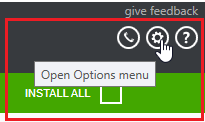
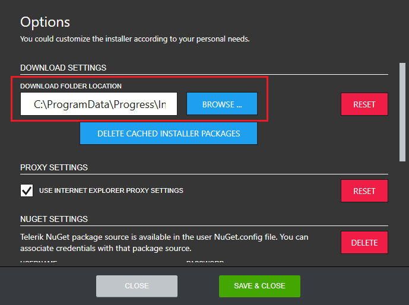

# How to change the Progress Control Panel default download location

By default the Progress Control Panel downloads all installation packages in *%programdata%\Progress\Installer\Downloads*. One can change this by opening the **Options** menu as shown below.

After the Options dialog pops up, in the **DOWNLOAD SETTINGS** section you will see the current download location.

In order to change the download location, click BROWSE and navigate to the desired folder. The default download location can be set back any time by clicking RESET.

## See Also

* [Telerik Control Panel Forum](https://www.telerik.com/forums/telerik-control-panel)
* [Progress® Telerik® Control Panel Feedback Portal](https://feedback.telerik.com/controlpanel) 
* [Essential support](http://www.telerik.com/support) 
