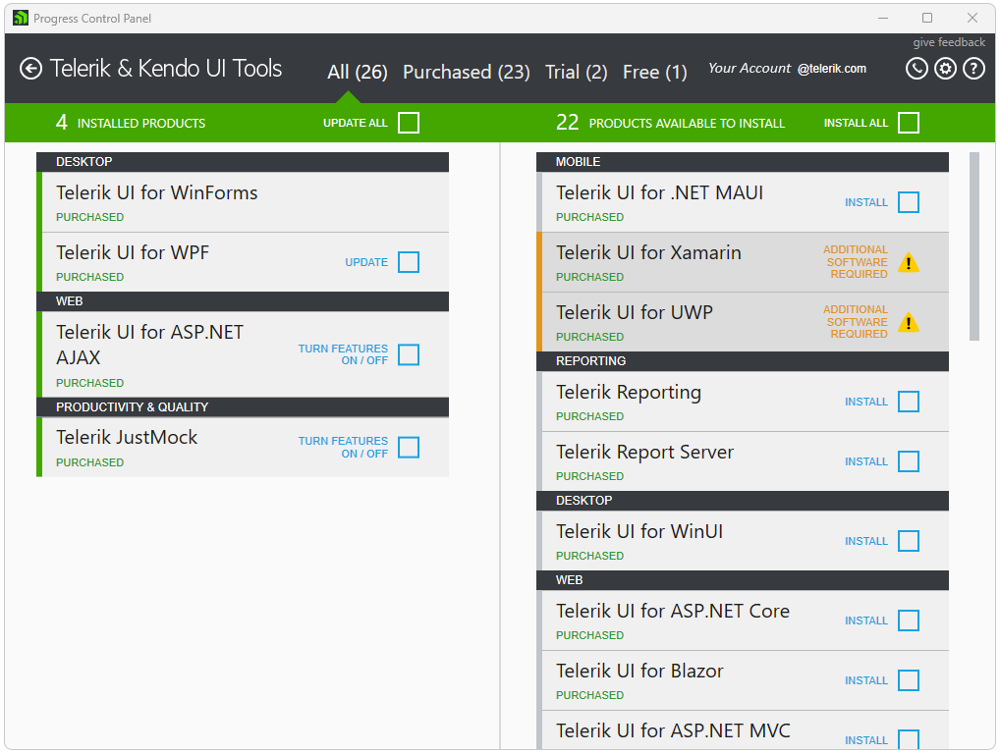
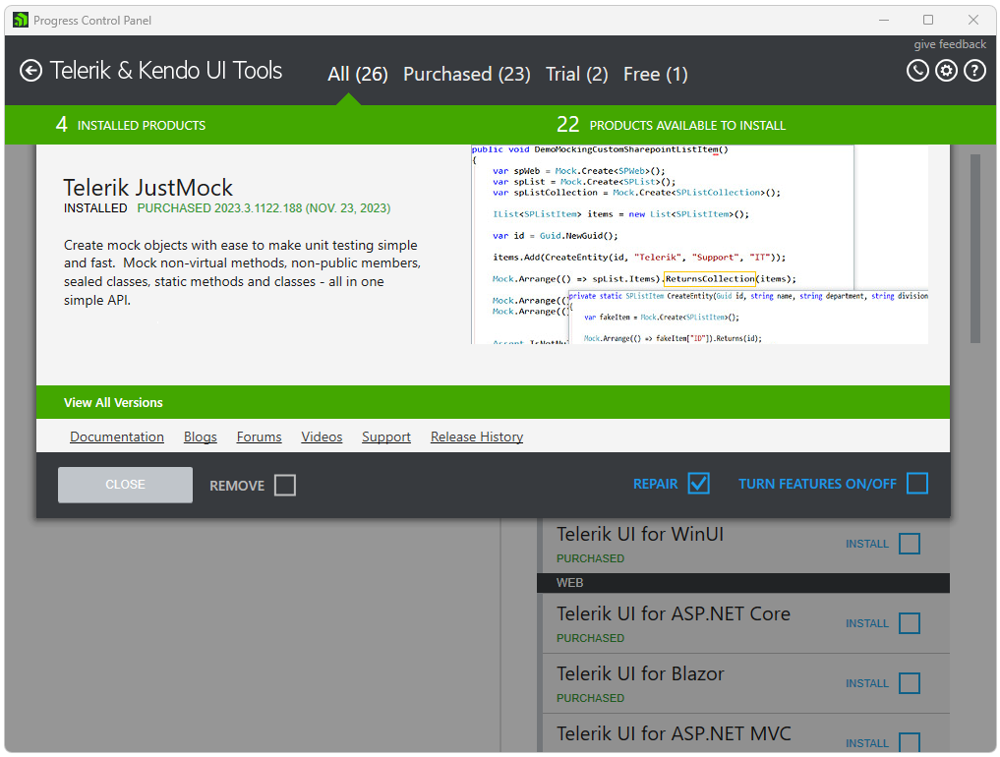
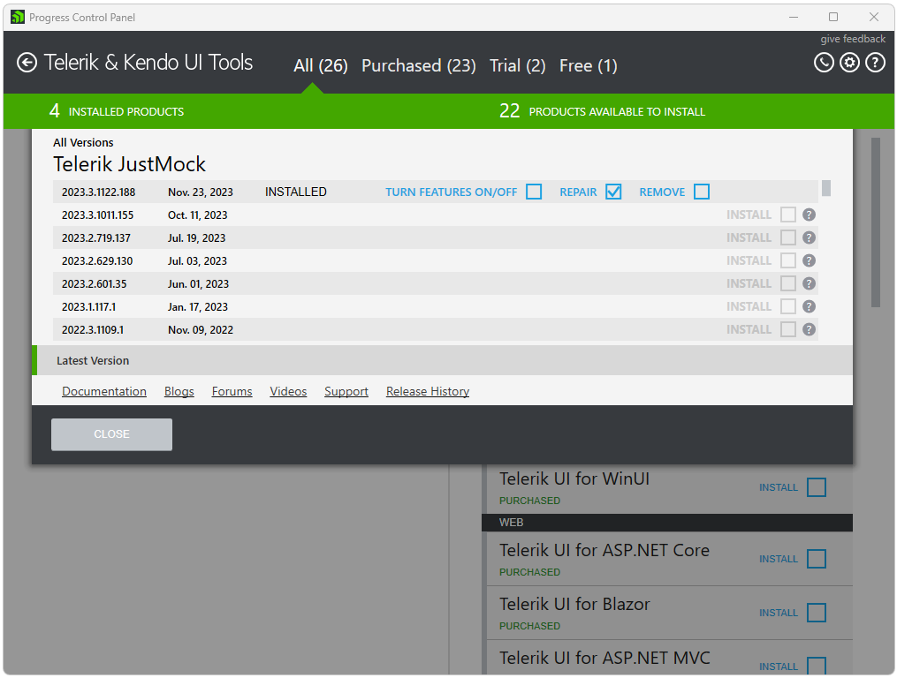
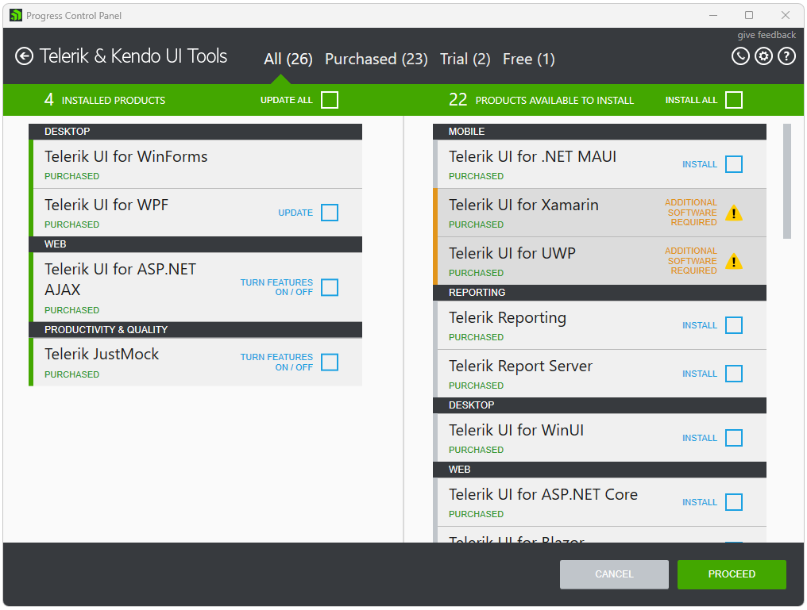

# How to repair a product

To repair an installed product through the Progress Control Panel you need to sign in first. After successful authentication you will see the available products for your account.

Choose a product on the left to be repaired and click on it to open the product [details view]().
 

Check the **REPAIR** checkbox and close the view.

If there are parallel versions of a product installed on the machine a click on the product to open the [product details]() view should be performed in order to repair. Expand the *All Versions* view in order to select a version to repair. Select the version that you would like to repair and close the view.

>note Repair operation is available for products newer than 2011 Q3. 

Click **PROCEED** to continue.

After you have selected which products to repair, in the preview view you can review your choice. Click **PROCEED** and the installation will start. After the installation has completed, you will be returned to the products view. 

## See Also

* [Telerik Control Panel Forum](https://www.telerik.com/forums/telerik-control-panel)
* [Progress® Telerik® Control Panel Feedback Portal](https://feedback.telerik.com/controlpanel) 
* [Essential support](http://www.telerik.com/support) 
