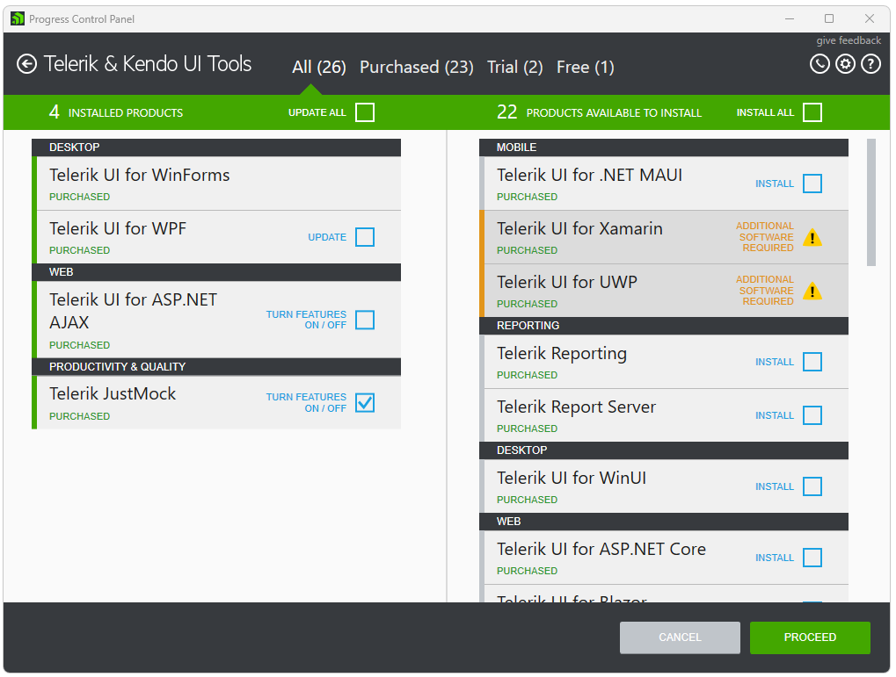
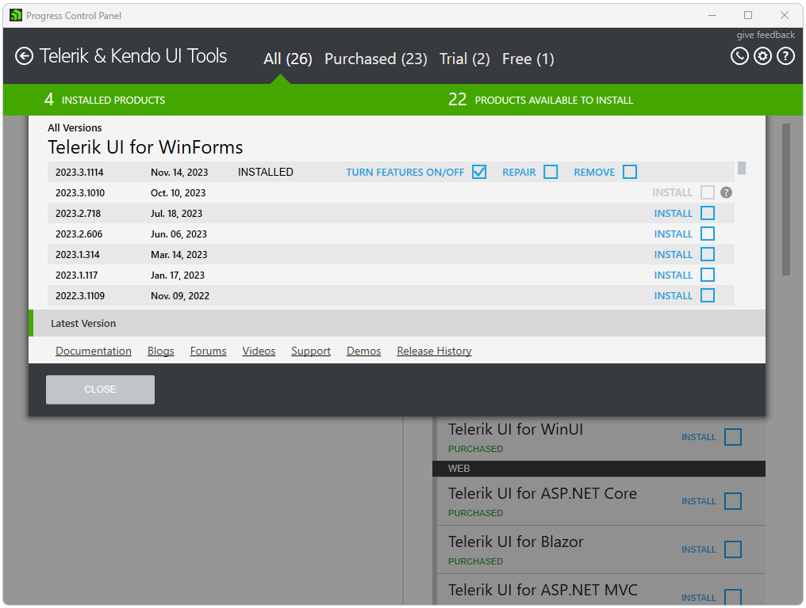
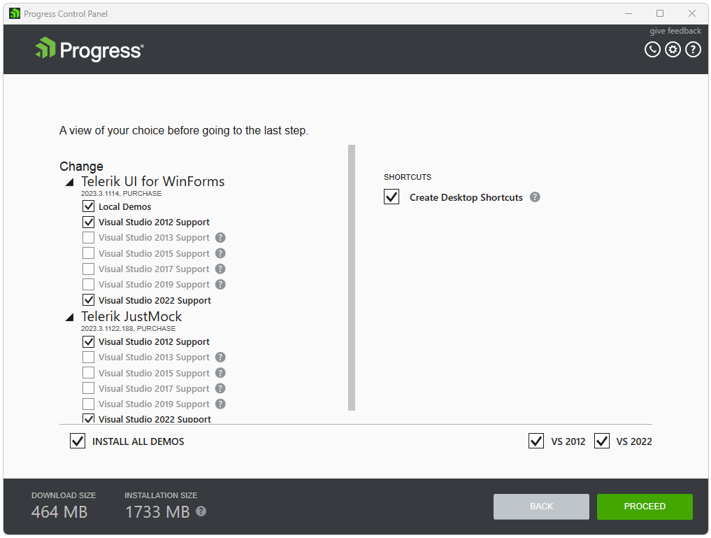

# How to turn features on/off?

To modify an installed product through the Progress Control Panel you need to sign in first. After successful authentication you will see the available products for your account.

Choose a product on the left to be modified and check the **TURN FEATURES ON/OFF** checkbox.

If there are parallel versions of a product installed on the machine a click on the product to open the product details view should be performed in order to modify. Expand the All Versions view in order to select a version to modify. Select the version that you would like to modify and close the view. 

>note Modify operation is available for products newer than 2012 Q3 that have editable features.  

Click **PROCEED** to continue.

After you have selected which products to modify, in the [products view]() choose which features to turn on or off. Then, click **PROCEED** and the installation will start. After the installation has completed, you will be returned to the products view.  

## See Also

* [Telerik Control Panel Forum](https://www.telerik.com/forums/telerik-control-panel)
* [Progress® Telerik® Control Panel Feedback Portal](https://feedback.telerik.com/controlpanel) 
* [Essential support](http://www.telerik.com/support) 
