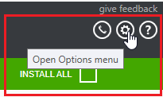
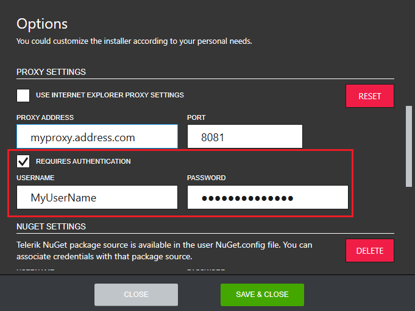

# How to set up proxy?

The Progress Control Panel requires a working internet connection. If you need to set up proxy to connect to the internet, you need to open the Options menu.

In the Options dialog, the default proxy settings are displayed in the PROXY SETTINGS section. By default, the installer uses the system proxy settings.

The default behavior could be changed by unchecking the **USE INTERNET EXPLORER PROXY SETTINGS** checkbox. After doing so, you will be requested to add the proxy settings manually.

In case the proxy requires authentication, the **REQUIRES AUTHENTICATION** checkbox must be checked and the credential section will appear.

The default proxy settings can be set back any time by clicking RESET.

## See Also

* [Telerik Control Panel Forum](https://www.telerik.com/forums/telerik-control-panel)
* [Progress® Telerik® Control Panel Feedback Portal](https://feedback.telerik.com/controlpanel) 
* [Essential support](http://www.telerik.com/support) 
