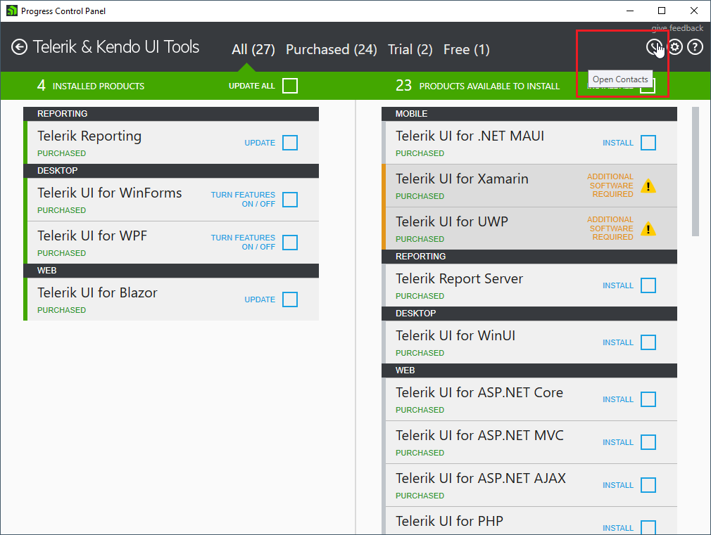
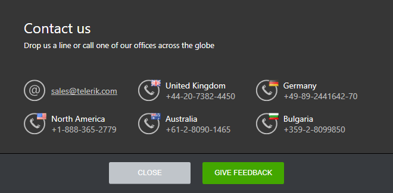
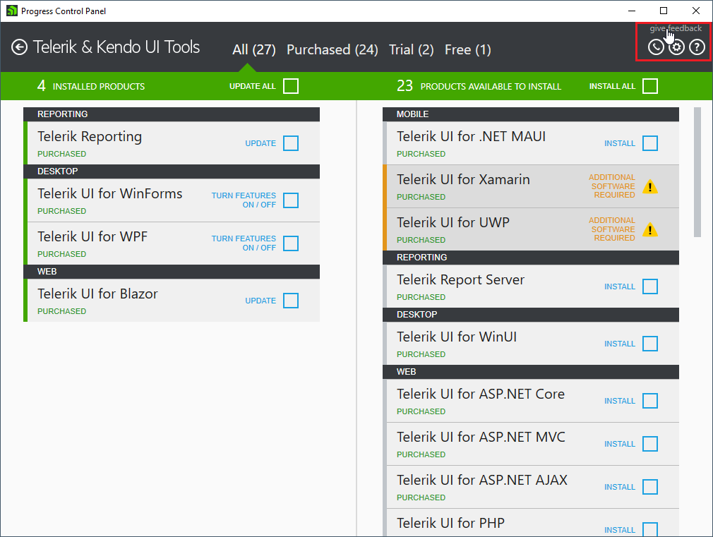

# Contacts and Feedback
## Contacts

You can find the Progress team contacts by clicking on the contacts button in the top right corner of the application.

## Feedback

We will appreciate your feedback. Please, share your thoughts by clicking the feedback link in the top
right corner of the application which navigates you to the [Progress® Telerik® Control Panel Feedback Portal](https://feedback.telerik.com/controlpanel).

## See Also

* [Telerik Control Panel Forum](https://www.telerik.com/forums/telerik-control-panel)
* [Progress® Telerik® Control Panel Feedback Portal](https://feedback.telerik.com/controlpanel) 
* [Essential support](http://www.telerik.com/support) 
