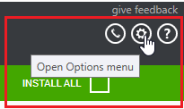
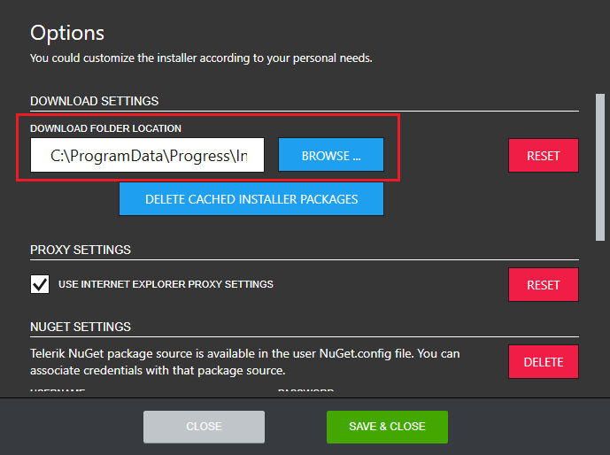

# Changing the Progress Control Panel Default Download Location

By default, the Progress Control Panel downloads all installation packages in `*%programdata%\Progress\Installer\Downloads*`. You can change this in the **Options** menu as shown below.

The **DOWNLOAD SETTINGS** section in the **Options** dialog shows the current download location.

To change the download location, click **BROWSE** and navigate to the desired folder. To go back to the default download location, click **RESET**.

## See Also

* [Telerik Control Panel Forum](https://www.telerik.com/forums/telerik-control-panel)
* [Progress® Telerik® Control Panel Feedback Portal](https://feedback.telerik.com/controlpanel) 
* [Essential support](http://www.telerik.com/support) 
