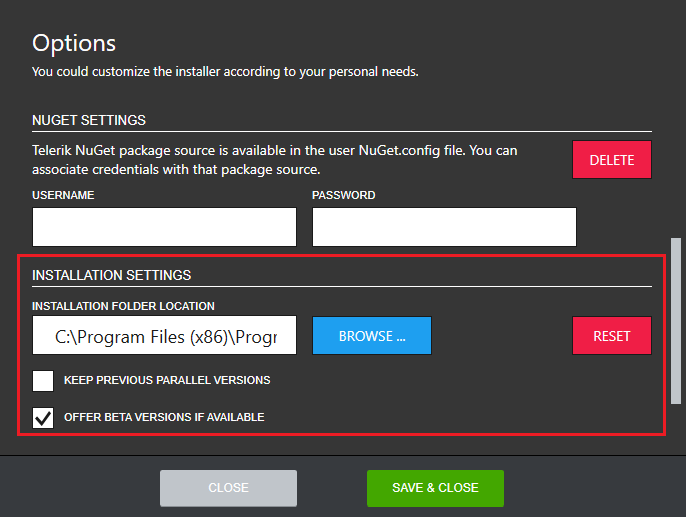

# Changing the Default Installation Location

The Progress Control Panel's default install location is [ProgramFilesDir]\Progress. To change this, you should open the Options menu as shown below.

 In the Options dialog, the default install location is displayed in the **INSTALLATION SETTINGS** section.

 

 In order to change the download location, click the BROWSE button and navigate to the desired folder. The default section settings can be set back any time by clicking RESET.

## See Also

* [Telerik Control Panel Forum](https://www.telerik.com/forums/telerik-control-panel)
* [Progress® Telerik® Control Panel Feedback Portal](https://feedback.telerik.com/controlpanel) 
* [Essential support](http://www.telerik.com/support) 
