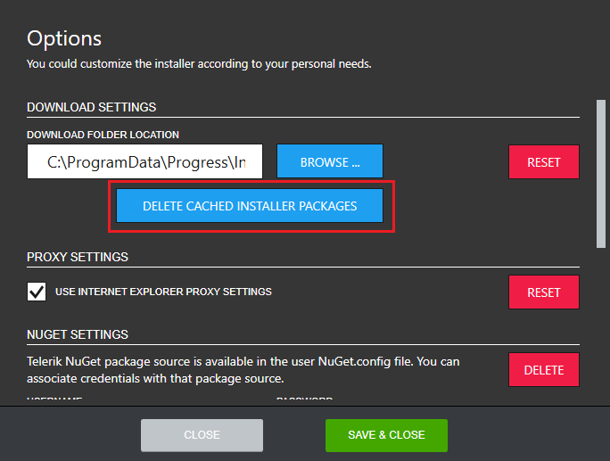
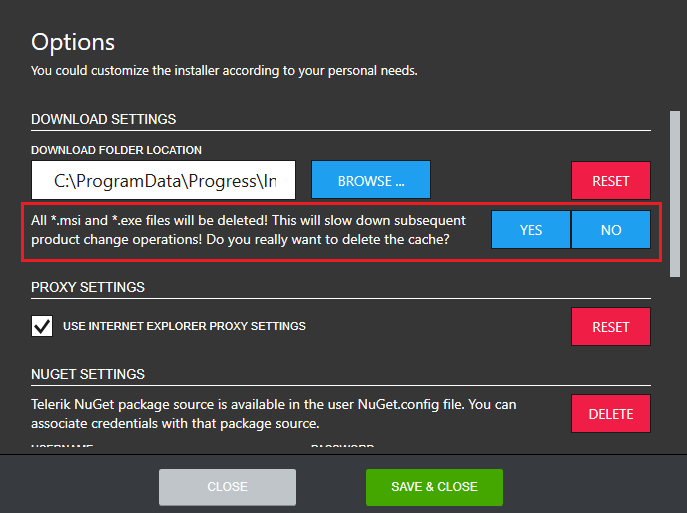
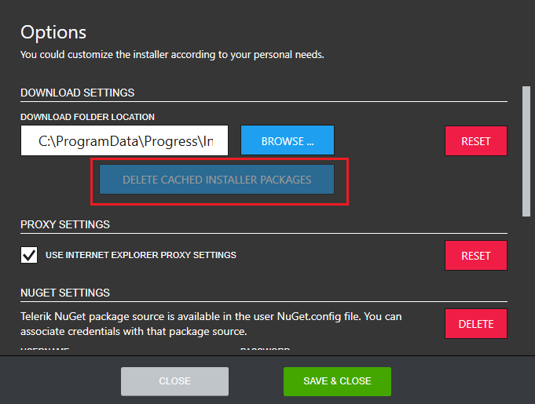
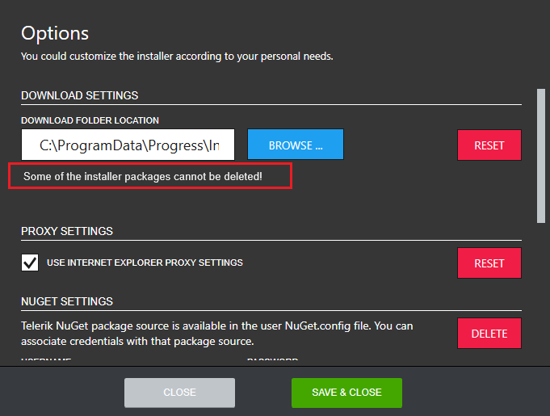

# Deleting the Progress Control Panel installer packages cache?

You can clear the installer packages in the download folder by opening the Options menu as shown below.

After the Options dialog pops up, in the **DOWNLOAD SETTINGS** section you will see the current download location and the **DELETE CACHED INSTALLER PACKAGES** button below it.

Click **DELETE CACHED INSTALLER PACKAGES** and confirm the operation.

Removing the cached installer packages will lead to disabling the **DELETE CACHED INSTALLER PACKAGES** button if the operation succeeds or a message will be shown in the case of failure.

 

## See Also

* [Telerik Control Panel Forum](https://www.telerik.com/forums/telerik-control-panel)
* [Progress® Telerik® Control Panel Feedback Portal](https://feedback.telerik.com/controlpanel) 
* [Essential support](http://www.telerik.com/support) 
