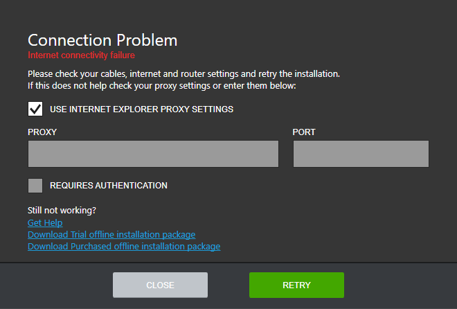

# Connection Problem Message

The Connection Problem screen pops up every time the installer hits a connectivity problem.

It is possible to get this screen at startup which means that the initial web service calls of the application have failed. Before hitting the RETRY button, please, ensure that you have a working internet connection. 

If a proxy is used to connect to the internet, you can adjust the installer proxy settings by unchecking the **USE INTERNET EXPLORER PROXY SETTINGS** checkbox (for further details about how to set up proxy, please, refer to the [How to set up proxy?]() section). The entered settings will be stored and will be available for edit in the Options menu. 

In case the problem persists, do not hesitate to contact our support team by clicking the Get Help link. Meanwhile, you can download an offline installer package to install the desired product by clicking the Download Trial offline installation package for downloading trials or Download Purchased offline installation package for downloading the licensed versions of our products.  

## See Also

* [Telerik Control Panel Forum](https://www.telerik.com/forums/telerik-control-panel)
* [Progress® Telerik® Control Panel Feedback Portal](https://feedback.telerik.com/controlpanel) 
* [Essential support](http://www.telerik.com/support) 
