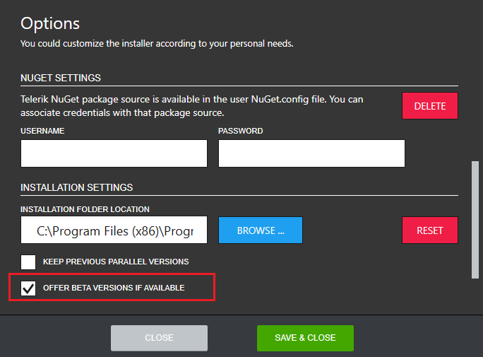

# How to enable or disable product Beta versions?

By default the Progress Control Panel shows the latest Beta version of each product if available. To change this, you should open the Options menu as shown below.

 In the Options dialog, the default behavior regarding product Beta versions is displayed in the **INSTALLATION SETTINGS** section.

 

In order to prevent the Progress Control Panel from showing Beta versions check the OFFER BETA VERSIONS IF AVAILABLE checkbox. The default section settings can be set back any time by clicking RESET.

## See Also

* [Telerik Control Panel Forum](https://www.telerik.com/forums/telerik-control-panel)
* [Progress® Telerik® Control Panel Feedback Portal](https://feedback.telerik.com/controlpanel) 
* [Essential support](http://www.telerik.com/support) 
