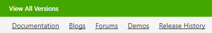

# Installing Telerik Products

To install a product through the Progress Control Panel you need to sign in first. After successful authentication you will see the available products for your account.

### Installation state

The products' installation state is displayed in the product detailed view as follows: 

* **INSTALLED** = Fully or partially installed product 
* **MULTIPLE VERSIONS INSTALLED** = Multiple versions installed, i.e. Q1 2013 and Q2 2013 (applicable for products that support parallel installations only) 
* **NOT INSTALLED** = Not installed product 
* **OLDER VERSION INSTALLED** = Older version is installed with limited support in the tool (versions before Q3 2011) 
* **NEWER VERSION INSTALLED** = Newer than the latest official version is installed (possible if an internal build is installed on the machine) 

### License 
 
The product license is displayed next to the installation state. It is one of the following: 

* **PURCHASED** - Licensed product 
* **TRIAL** - Trial product 
* **FREE** - Free product 

### Version & Release date 

In the product details view one can check the version and the release date of the product. They are displayed just after the **Installation State** and the **License**.

### Prerequisites

If any blocking issues occur, they should be resolved first, in order to continue with the installation. All requirements are displayed in red right under the product Installation State, License and Version:

### All Versions 

In order to access all versions of the product you have license for, you can click on the **View All Versions** button which will switch to the All Versions view.

In the **All Versions** view one can see a list of all products he has access to. This view provides the opportunity to operate with versions different than the latest one (including the latest Beta version if available). You can install previous versions or maintain old versions (e.g. perform modify, repair or remove). Additionally, there is an option to perform multiple actions with one configuration only.  

The **All Versions** view makes the dependencies between the product versions more clear. When selecting a version for install, the Progress Control Panel automatically resolves dependencies between the versions. This could trigger an installation of older conflicting versions or can disable the option to install previous conflicting version.

The version dependency resolving depends on the **‘KEEP PREVIOUS PARALLEL VERSIONS’** option in the options menu. If the option is not checked, the dependency resolving mechanism will check older parallel versions for removal. Otherwise, old version won’t be pre-selected for removal.
 
The visibility of the latest Beta version depends on the **‘OFFER BETA VERSIONS IF AVAILABLE’** option in the options menu. The Beta version is visible if the option is enabled and if it is the latest product version. Older Beta versions are not visible regardless the ‘OFFER BETA VERSIONS IF AVAILABLE’ option.

### Online resources 

In the product details view, you can find hyperlinks to the online resources for a product, e.g. Documentation, Blogs, Forums and Videos. 

## Actions

 
On the right side of the products view, select product(s) to be installed by checking the install checkbox of each product and click **PROCEED**. **INSTALL ALL** option is available too.

All applicable product actions are displayed at the bottom of product details view. The possibly available actions include INSTALL, UPDATE, REPAIR, MODIFY and REMOVE. Only one action per product can be scheduled for execution.

# Preview

After you have selected some product actions, they are displayed in the preview step for final arrangement. The preview step provides:

* **Feature selection option** - The editable features include all Visual Studio integration features for a product.
* **Install location selection option** - Prior to running the installation, you can change the installation folder for this run.
* **Disk cost estimations**
* **License Agreement**

After you have selected which products to install, in the preview view you can configure the product features and the installation folder. In order to run the installation, you should accept the license agreement. Then, click **PROCEED** and the installation will start. After the installation has completed, you will be returned to the products view.

## Installation progress

The installation progress view displays the installation information in three progress bars:
 * **Download progress**
 * **Current operation progress**
 * **Overall progress**

After you have selected which products to install, in the preview view you can configure the product features and the installation folder. In order to run the installation, you should accept the license agreement. Then, click **PROCEED** and the installation will start. After the installation has completed, you will be returned to the products view.

<!-- ### Download progress

The download progress bar displays the download progress for the installation. On the right side you will
see the downloaded megabytes and the total download estimation.

### Current operation progress

The current operation progress bar shows the current operation progress. The current operation can be
one of the following: installation, repair and uninstallation. In the middle of the progress bar the current
operation name is displayed and on the right – the operation details.

### Overall progress

The overall progress bar shows the overall installation progress. It displays the completed operations
and the total operation count. -->

## Installation Troubleshooting

In case you have any failed installations, you will see an error summary screen which describes the failed
installations.

In the left corner you will see the ‘TROUBLESHOOT PROBLEMS’ link. Click the link in order to get detailed information regarding the reason for the failure of each installation.

Additionally, you have the opportunity to send an error report by checking the ‘Send Error Report’ checkbox before closing this screen. To preview the content of the reports you would send, click the ‘PREVIEW ERROR REPORT’ link. Sending an error report will increase your chance to receive faster and more accurate answer in case you contact our support team and will help us in maintaining our products and solutions, so we can provide the top quality you expect.

In the ‘Installation Troubleshooting’ dialog a list of the failed installation is present. You can select a product on the left and check the reason for the failure and a possible solution on the right side of the window.

## See Also

* [Telerik Control Panel Forum](https://www.telerik.com/forums/telerik-control-panel)
* [Progress® Telerik® Control Panel Feedback Portal](https://feedback.telerik.com/controlpanel) 
* [Essential support](http://www.telerik.com/support) 
