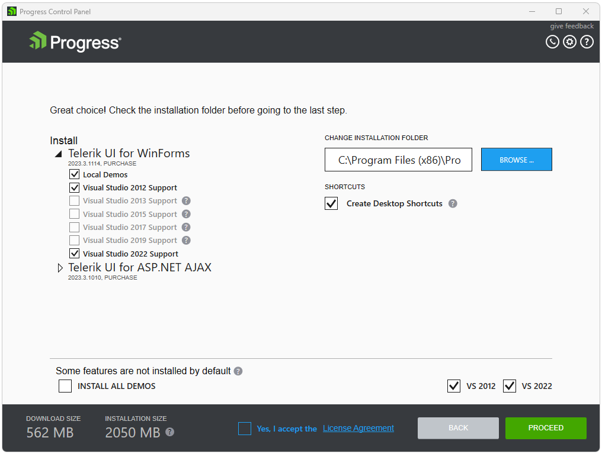

# Installing Telerik Products

To install a product through the Progress Control Panel you need to sign in first. After successful authentication you will see the available products for your account.

 
On the right side of the [products view](), select product(s) to be installed by checking the install checkbox of each product and click **PROCEED**. **INSTALL ALL** option is available too.

After you have selected which products to install, in the [preview view]() you can configure the product features and the installation folder. In order to run the installation, you should accept the license agreement. Then, click **PROCEED** and the installation will start. After the installation has completed, you will be returned to the products view.

## See Also

* [Telerik Control Panel Forum](https://www.telerik.com/forums/telerik-control-panel)
* [Progress® Telerik® Control Panel Feedback Portal](https://feedback.telerik.com/controlpanel) 
* [Essential support](http://www.telerik.com/support) 
