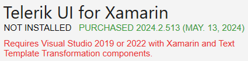
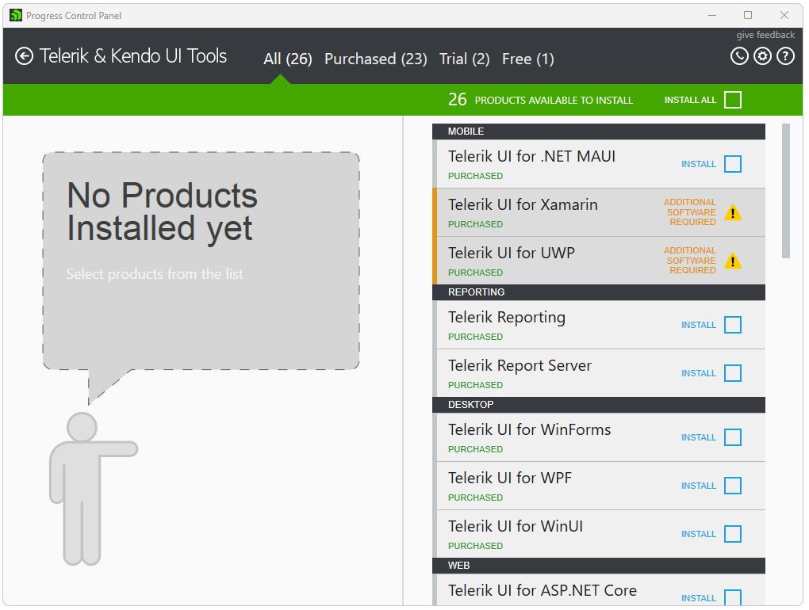
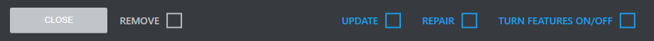
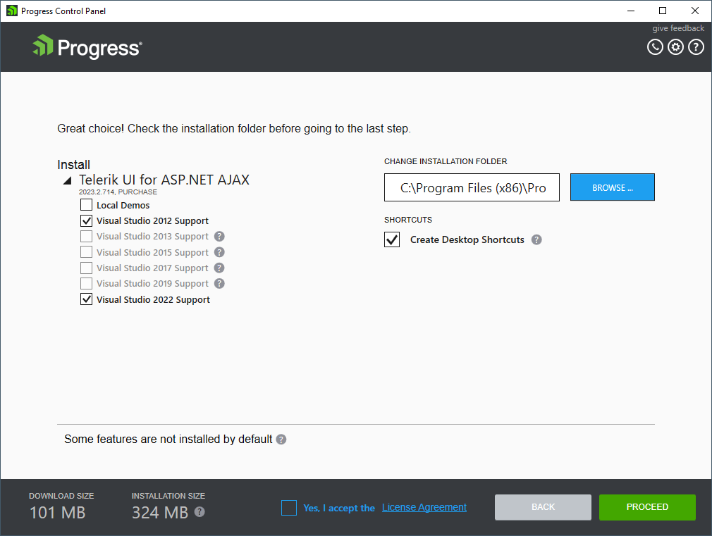
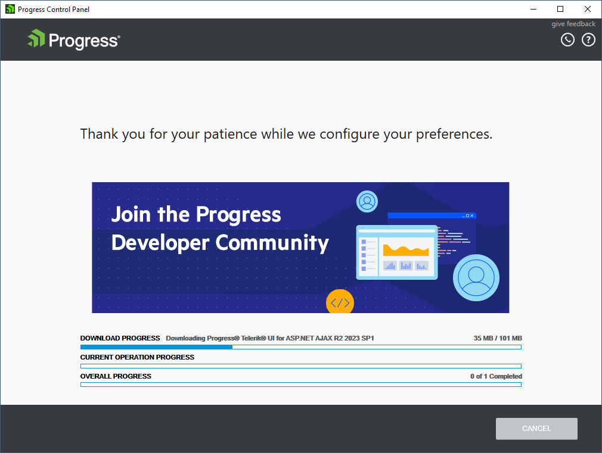
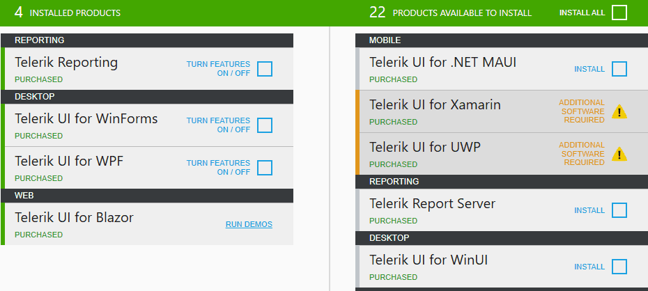

# Installing Telerik Products

To install a product through the Progress Control Panel, you must sign in with your Telerik account. After successful authentication, you will see the products available for your account.

## Verifying the Installation State

Before installing a product, verify its installation state by navigating to the [Product Details](#showing-the-product-details) view, and can be either of the following: 

* **INSTALLED**—The product is fully or partially installed. 
* **MULTIPLE VERSIONS INSTALLED**—Multiple versions are installed (applicable only to products that support parallel installations).
* **NOT INSTALLED**—The product is not installed. 
* **OLDER VERSION INSTALLED**—An older version with limited support in the tool is installed (versions prior to Q3 2011).
* **NEWER VERSION INSTALLED**—A product version later than the latest official version is installed (possible if you install an internal build version).

## Verifying the Available Licenses 
 
The product license is displayed next to the installation state and can be either of the following: 

* **PURCHASED**—A product for which you've purchased a license.
* **TRIAL**—A product with an activated trial license.
* **FREE**—A product that is free to use.

## Checking the Prerequisites

To install some products, your system must meet specific requirements. All requirements are displayed in red right under the product's Installation State, License, and Version:

## Installing the Selected Products

On the right side of the **Telerik & Kendo UI Tools** view, select the desired products and then click **PROCEED**. The **INSTALL ALL** option will install all available products.

 
For more installation options, see the [Product Details](#showing-the-product-details) view by clicking the desired product. All applicable product actions are at the bottom of the Product Details view. The following actions may be available depending on the current state of the product: INSTALL, UPDATE, REPAIR, MODIFY, and REMOVE. You can schedule only one action per product.

<!--
###  Preview

After you have selected some product actions, they are displayed in the preview step for final arrangement. The preview step provides:

* **Feature selection option** - The editable features include all Visual Studio integration features for a product.
* **Install location selection option** - Prior to running the installation, you can change the installation folder for this run.
* **Disk cost estimations**
* **License Agreement**

After you have selected which products to install, in the preview view you can configure the product features and the installation folder. In order to run the installation, you should accept the license agreement. Then, click **PROCEED** and the installation will start. After the installation has completed, you will be returned to the products view.

## Installation progress

The installation progress view displays the installation information in three progress bars:
 * **Download progress**
 * **Current operation progress**
 * **Overall progress**

After you have selected which products to install, in the preview view you can configure the product features and the installation folder. In order to run the installation, you should accept the license agreement. Then, click **PROCEED** and the installation will start. After the installation has completed, you will be returned to the products view.
-->

## Installing Previous Versions 

To access all previous versions of the product you have a license for, click the **View All Versions** button, which will switch to the **All Versions** view.

The **All Versions** view allows you to:

* See a list of all product versions available to your client account.
* Install previous product versions.
* Install the latest beta version (only if the **OFFER BETA VERSIONS IF AVAILABLE** option in the options menu is enabled; previous beta versions are never visible).
* Modify or repair installations of previous product versions.
* Perform multiple actions with a single configuration.   

The **All Versions** view visualizes the dependencies between the product versions. When you select a version for installation, the Progress Control Panel automatically resolves the dependencies between the versions. This may trigger the installation of older conflicting versions or can disable the option to install previous conflicting versions.

The version dependency resolution depends on the **KEEP PREVIOUS PARALLEL VERSIONS** option in the options menu:

* If the option is disabled, the dependency resolution mechanism will check previous parallel versions for removal.
* If the option is enabled, the dependency resolution mechanism will not pre-select previous versions for removal.

<!-- ### Download progress

The download progress bar displays the download progress for the installation. On the right side you will
see the downloaded megabytes and the total download estimation.

### Current operation progress

The current operation progress bar shows the current operation progress. The current operation can be
one of the following: installation, repair and uninstallation. In the middle of the progress bar the current
operation name is displayed and on the right – the operation details.

### Overall progress

The overall progress bar shows the overall installation progress. It displays the completed operations
and the total operation count. -->

## See Also

* [Telerik Control Panel Forum](https://www.telerik.com/forums/telerik-control-panel)
* [Progress® Telerik® Control Panel Feedback Portal](https://feedback.telerik.com/controlpanel) 
* [Essential support](http://www.telerik.com/support) 
