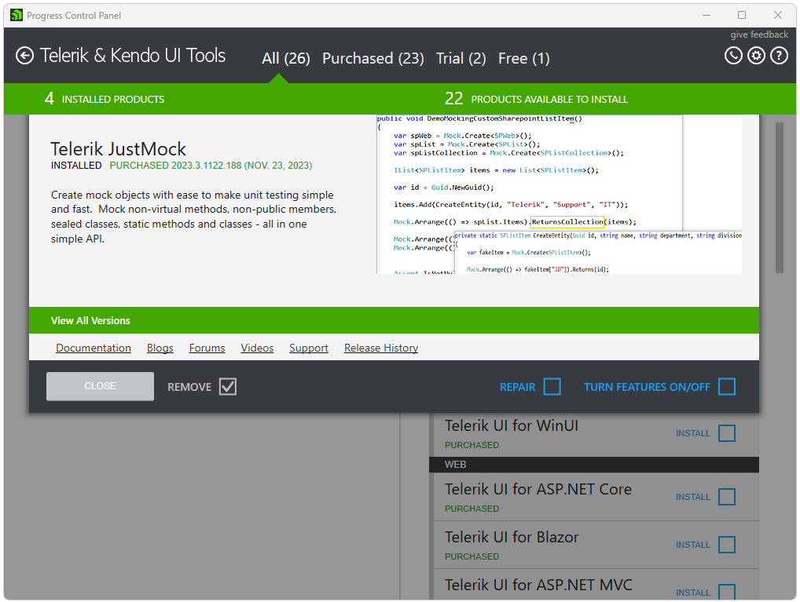
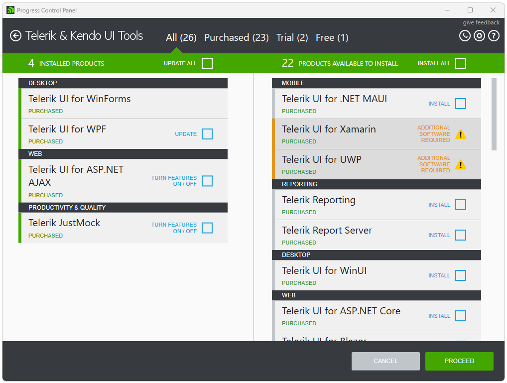
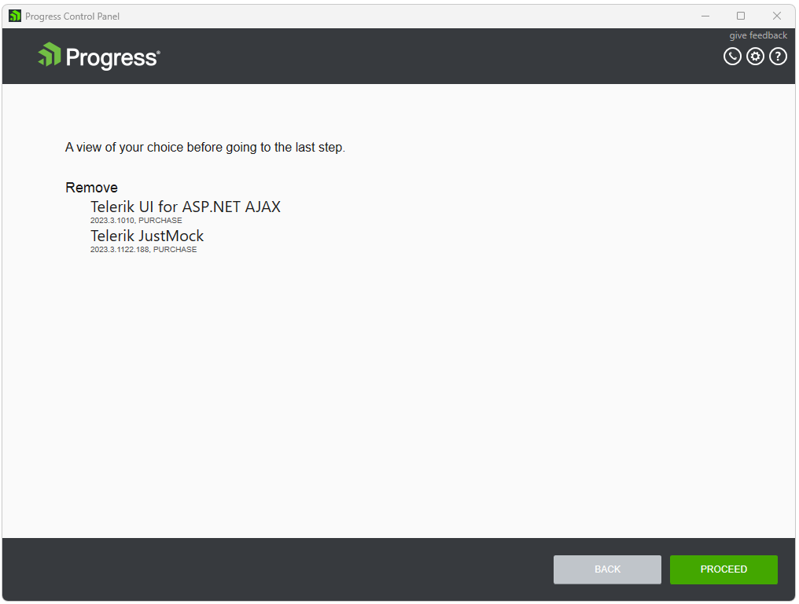

# Uninstalling Telerik Products

To uninstall an installed product through the Progress Control Panel you need to sign in first. After successful authentication you will see the available products for your account.

Choose a product on the left to be uninstalled and click on it to open the [product details]() view.

Check the **REMOVE** checkbox and close the view.

Click **PROCEED** to continue.

After you have selected which products to remove, in the preview view you can review your choice. Click **PROCEED** and the installation will start. After the installation has completed, you will be returned to the products view.

## See Also

* [Telerik Control Panel Forum](https://www.telerik.com/forums/telerik-control-panel)
* [Progress® Telerik® Control Panel Feedback Portal](https://feedback.telerik.com/controlpanel) 
* [Essential support](http://www.telerik.com/support) 
