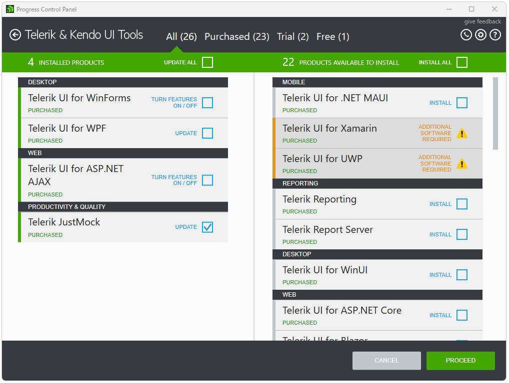
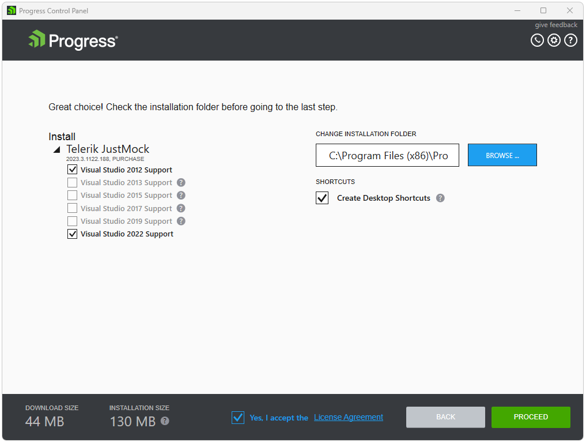
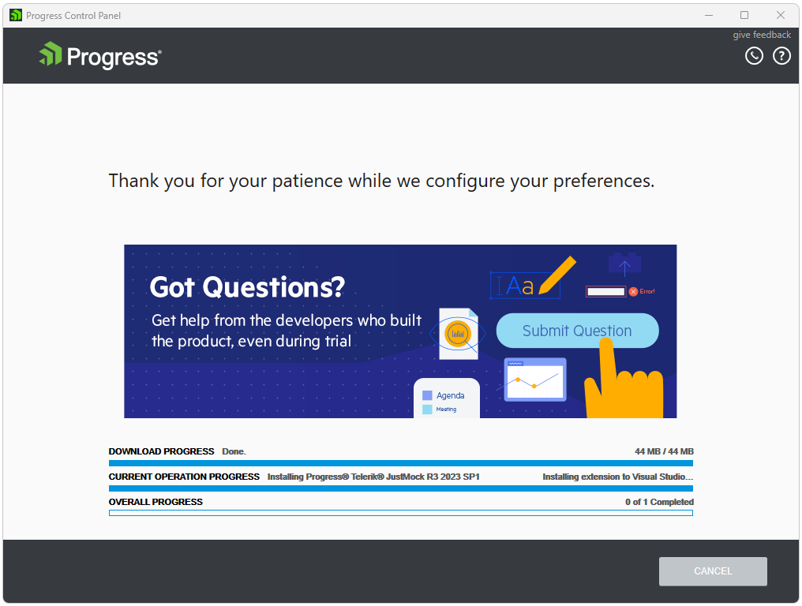

# Updating Telerik Products

To update an installed product through the Progress Control Panel you need to sign in first. After successful authentication you will see the available products for your account, both installed and available to install.

On the left side of the [products view](), select product(s) to be updated by checking the **UPDATE** checkbox of each product. Note that only products that have updates available will have the **UPDATE** option. **UPDATE ALL** option is available too. After you have selected the products to be updated, click **PROCEED**.
 

After you have selected which products to update, in the [preview view]() you can configure the product features and the installation folder. In order to run the installation, you should accept the license agreement. Then, click **PROCEED** and the installation will start. 

After the installation has completed, you will be returned to the products view.  

## See Also

* [Telerik Control Panel Forum](https://www.telerik.com/forums/telerik-control-panel)
* [Progress® Telerik® Control Panel Feedback Portal](https://feedback.telerik.com/controlpanel) 
* [Essential support](http://www.telerik.com/support) 
