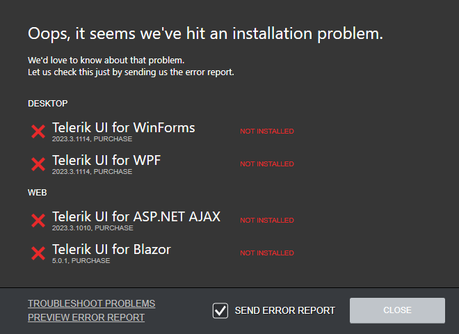
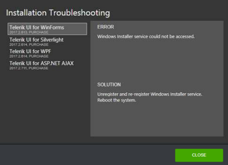

## Installation Troubleshooting

In case any product installations fail, you will see an error summary screen that describes the failed installations.

At the bottom, you can select the following options:

* A **TROUBLESHOOT PROBLEMS** link&mdash;Click the link to get detailed information regarding the reason for the failure of each installation.
* A **Send Error Report** checkbox&mdash;Sends an error report upon closing the dialog.
* A **PREVIEW ERROR REPORT** link&mdash;Displays the content of the report that will be sent. Sending an error report helps you receive faster and more accurate answers when contacting the Telerik support team, and helps the developers maintain the high quality you expect.

Clicking the **TROUBLESHOOT PROBLEMS** link opens the **Installation Troubleshooting** dialog, showing a failed installations list. You can select a product on the left and check the reason for the failure and a possible solution on the right side of the window.

