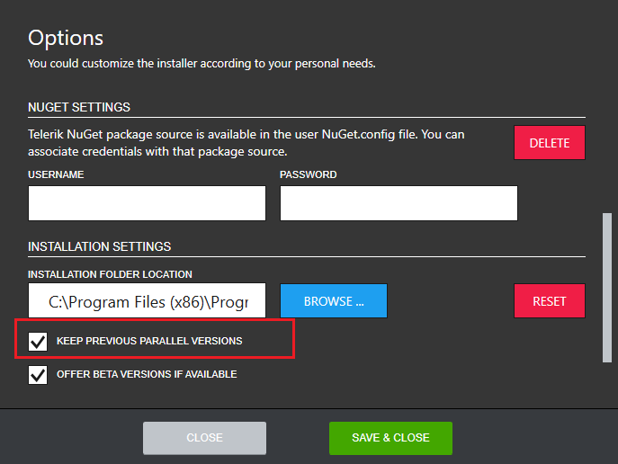

# Preventing the Progress Control Panel from Removing Previous Parallel Versions

By default the Progress Control Panel removes all previous parallel versions. To change this, you should open the Options menu as shown below.

 In the Options dialog, the default installation behavior is displayed in the **INSTALLATION SETTINGS** section.

 

 In order to prevent the Progress Control Panel from removing previous parallel versions check the KEEP PREVIOUS PARALLEL VERSIONS checkbox. The default section settings can be set back any time by clicking RESET.

## See Also

* [Telerik Control Panel Forum](https://www.telerik.com/forums/telerik-control-panel)
* [Progress® Telerik® Control Panel Feedback Portal](https://feedback.telerik.com/controlpanel) 
* [Essential support](http://www.telerik.com/support) 
