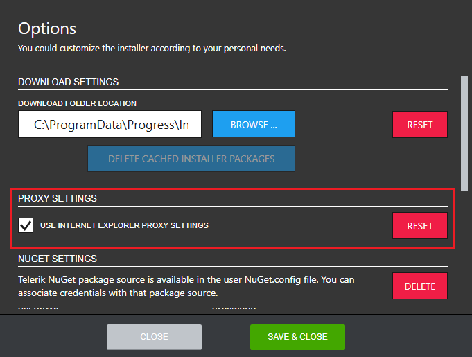
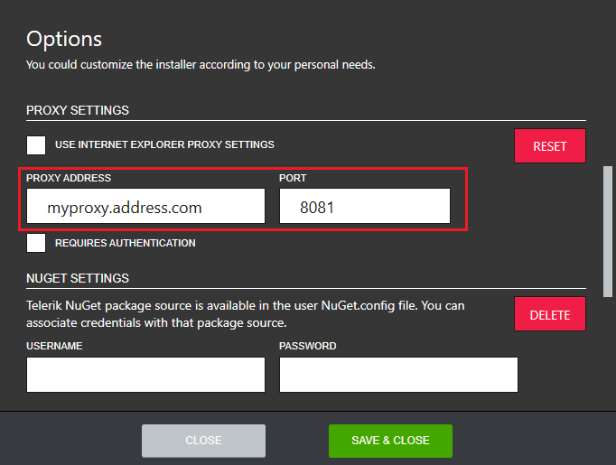
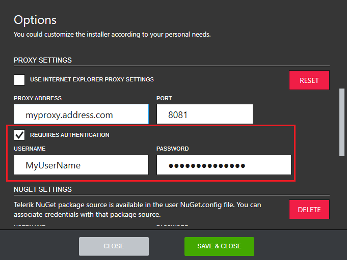

# Setting Up a Proxy

The Progress Control Panel requires a working internet connection. If you need to set up proxy to connect to the internet, go to the **Options** menu.

In the **Options** dialog, the default proxy settings are displayed in the **PROXY SETTINGS** section. By default, the installer uses the system proxy settings.

To set up a custom proxy, uncheck the **USE INTERNET EXPLORER PROXY SETTINGS** checkbox and add the proxy settings manually. The **PROXY ADDRESS** and **PORT** fields are required.

If the proxy server requires authentication, select the **REQUIRES AUTHENTICATION** checkbox then enter the credentials (the **USERNAME** field is required).

To restore the default proxy settings, select **RESET**.

## See Also

* [Telerik Control Panel Forum](https://www.telerik.com/forums/telerik-control-panel)
* [Progress® Telerik® Control Panel Feedback Portal](https://feedback.telerik.com/controlpanel) 
* [Essential support](http://www.telerik.com/support) 
