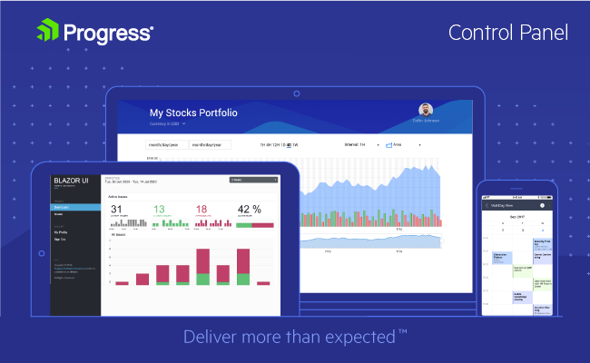
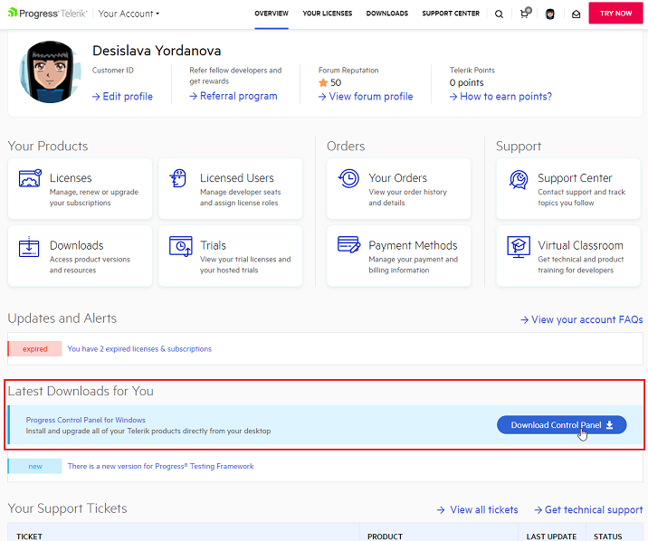
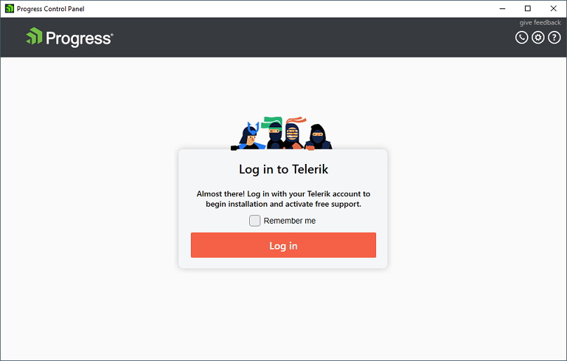
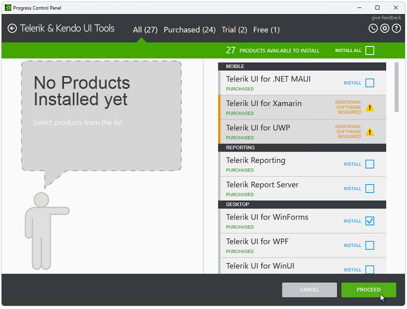
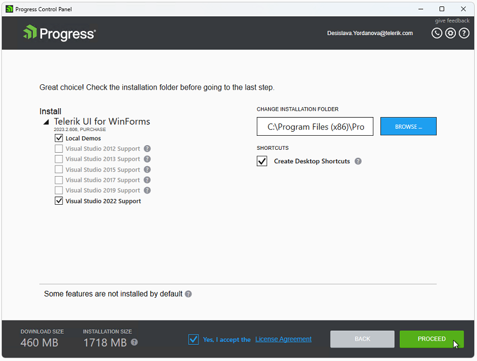
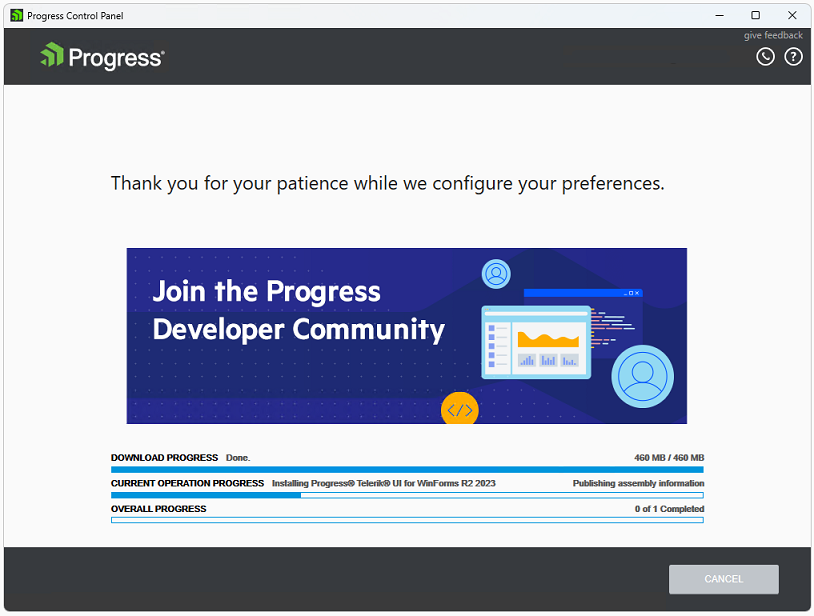
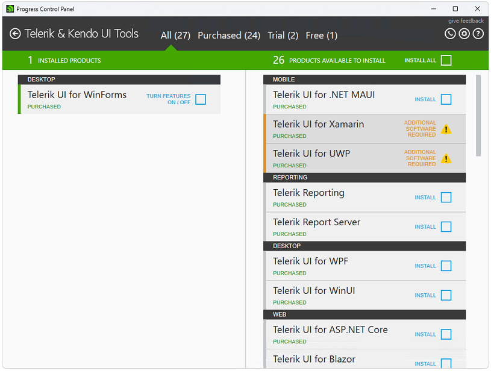

# Installing On Your Computer

## Getting Started

To get started, download the Progress Control Panel from [telerik.com](https://www.telerik.com/) by visiting your [account page](https://www.telerik.com/account/). The option to download and install the Control Panel is front and center on the page.

## Download and Log in

Download the Progress Control Panel from [telerik.com](https://www.telerik.com/) by visiting your [account page](https://www.telerik.com/account/). The option to download and install the Control Panel is front and center on the page.

Another option is to download the Progress Control Panel from the following [page](https://www.telerik.com/download-trial-file/v2/control-panel) and run the downloaded .exe file. You will soon be presented with the log in screen where you need to provide your Telerik account credentials to sign in.

On start up the Progress Control Panel will prompt you to sign in with an activated Telerik account (the
account used for the Telerik web site – www.telerik.com). A ‘Remember me’ option is available, which
provides an option the entered credentials to be remembered. If you store your credentials, you will be
signed in automatically on the next startup of the application.

>caption The Progress Control Panel Log in Screen

After you have signed in, you can find the sign out option by hovering on the email
on the top right corner of the application.

>caption The Progress Control Panel Log out Option

**2\. Select Products to Install**

Afterwards, you will be presented with a screen containing sections for All products, Purchased products, Trial products, and Free products. These sections each have a split screen view - the left contains installed products that can be updated and the right contains products that can be installed.

You can continue by selecting the Telerik UI for WinForms suite. Once you click the check box, the option to proceed or cancel will be displayed.

>caption The Progress Control Panel List of Available Products

**3\. Configure Installation**

Once you click Proceed, you will then be given the opportunity to review your choice and make changes to the installation folder. When you're ready to proceed, accept the license agreements and click Proceed once more. If you forgot something or checked the wrong box, click Back and correct your selection.

>caption The Progress Control Panel Installation Configuration Page

When you click Proceed, the Progress Control Panel will download the necessary files for installation and then install them to the location you selected.

**4\. Next Steps**

After the installation is complete, you will be returned to the main screen to install or update more products.

>caption The Progress Control Panel with Telerik UI for WinForms Installed

## See Also

* [Telerik Control Panel Forum](https://www.telerik.com/forums/telerik-control-panel)
* [Progress® Telerik® Control Panel Feedback Portal](https://feedback.telerik.com/controlpanel) 
* [Essential support](http://www.telerik.com/support) 
