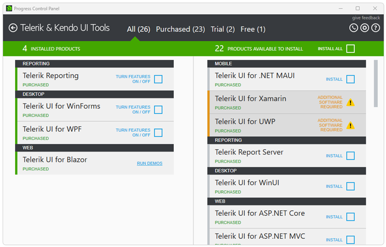

# Welcome to Progress Control Panel

Progress Control Panel is a standalone desktop application for Windows that enables developers to install, monitor, and manage their Telerik products.

## Key Features

* Install, uninstall, or repair Telerik products

* Update installed Telerik products

* View your Telerik licenses

## Supported Products

The Control Panel allows developers to manage the installation and updates of a wide range of Telerik products, including UI components, developer tools, and platform-specific solutions for web, desktop, and mobile applications.

|Supported Product| Documentation |
|----|----|
|Kendo UI for jQuery|[UI for jQuery documentation](https://docs.telerik.com/kendo-ui/introduction)|
|Telerik Reporting |[Telerik Reporting documentation](https://docs.telerik.com/reporting/introduction)|
|Telerik Report Server|[Telerik Report Server documentation](https://docs.telerik.com/report-server/introduction)|
|Telerik UI for .NET MAUI|[UI for .NET MAUI documentation](https://docs.telerik.com/devtools/maui/introduction)|
|Telerik UI for ASP.NET AJAX|[UI for ASP.NET AJAX documentation](https://docs.telerik.com/devtools/aspnet-ajax/introduction)|
|Telerik UI for ASP.NET Core|[UI for ASP.NET Core documentation](https://docs.telerik.com/aspnet-core/introduction)|
|Telerik UI for ASP.NET MVC|[UI for ASP.NET MVC documentation](https://docs.telerik.com/aspnet-mvc/introduction)|
|Telerik UI for Blazor|[UI for Blazor documentation](https://docs.telerik.com/blazor-ui/introduction)|
|Telerik UI for Xamarin|[UI for Xamarin documentation](https://docs.telerik.com/devtools/xamarin/introduction)|
|Telerik UI for WinForms|[Installing WinForms from Progress Control Panel](https://docs.telerik.com/devtools/winforms/installation-and-upgrades/installing-from-progress-control-panel)|
|Telerik UI for WPF|[Installing WPF from Progress Control Panel](https://docs.telerik.com/devtools/wpf/getting-started/installation/installation-installing-from-progress-control-panel)|
|Telerik UI for WinUI|[UI for WinUI documentation](https://docs.telerik.com/devtools/winui/introduction)|

## Getting Support

For any issues you might encounter while working with Progress Control Panel, use any of the available support channels:

* Commercial Telerik license holders and active trialists can take advantage of our outstanding customer support delivered by the developers of the application. To submit a support ticket, use the [Telerik dedicated support](https://www.telerik.com/account/support-tickets/) system.

* The [Progress Control Panel forum](https://www.telerik.com/forums/telerik-control-panel) is a part of the free support you can get from the community and from the Telerik team on all kinds of general issues.

* The [Progress Control Panel feedback portal](https://feedback.telerik.com/controlpanel) provides information about the planned new features and lets you vote for those you need. It also allows you to submit bug reports. 

## Improving the Progress Control Panel Documentation

We believe that the documentation for a product is at its best when the content is a collaboration between the developers and consumers of that product. We encourage you to help us in the way that you choose:

* Create a pull request on GitHub&mdash;If you find an issue in the docs or even feel like creating new content, we'd be happy to have your contributions! Just fork our [documentation](https://github.com/telerik/controlpanel-docs/), make your changes using standard markdown, and submit a pull request.

* Submit a new issue on GitHub&mdash;If you find an issue with our docs, let us know is by creating an issue in our [Github repository](https://github.com/telerik/controlpanel-docs/issues). When creating an issue, please provide a descriptive title, be as specific as possible and link to the documentation in question. If you can provide a link to the closest anchor to the issue, that is even better.

## Next Steps

* [Installing On Your Computer]()
* [Installation progress and Troubleshooting]() 

## See Also

* [Installing On Your Computer]()
* [Installation progress and Troubleshooting]() 
* [Product Families and Subscriptions]()

