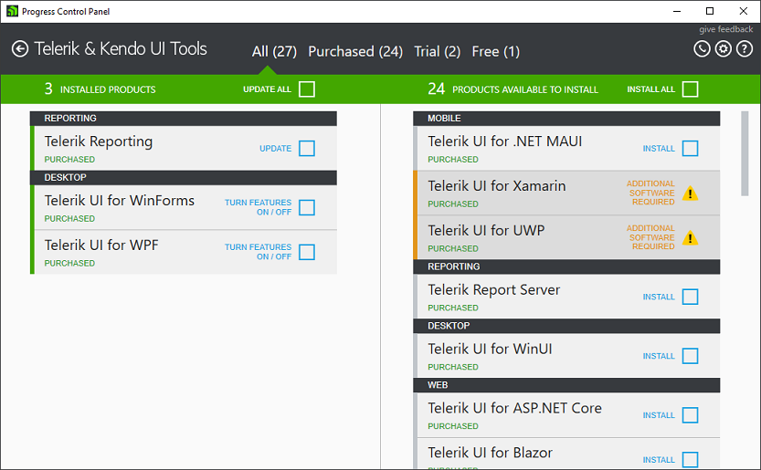
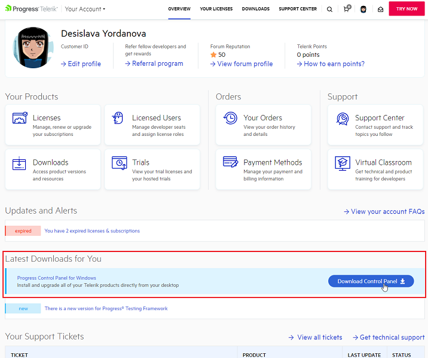

# Welcome to Progress Control Panel

**Progress Control Panel** is a standalone Windows desktop application that offers a range of features that enable users to monitor and manage their Telerik products and installations effectively.

## Key Features:

* Viewing existing Telerik product installations

* Downloading new Telerik products and updates

* Installing, uninstalling, or repairing Telerik products

The Progress Control Panel is an essential tool for developers and other software professionals who use Telerik products in their projects. With its robust features, intuitive interface, and reliable performance, it can help users streamline their workflows, minimize downtime, and ensure optimal performance for their software applications.

## Supported Products

The control panel provides a user-friendly interface that allows users to easily navigate and perform various operations. It supports a wide range of Telerik products, including UI components, developer tools, and platform-specific solutions for web, desktop, and mobile applications.

|Product||
|----|----|
|[Telerik UI for WinForms](https://docs.telerik.com/devtools/winforms/introduction)|[Installing from Progress Control Panel](https://docs.telerik.com/devtools/winforms/installation-and-upgrades/installing-from-progress-control-panel)|
|[Telerik UI for WPF](https://docs.telerik.com/devtools/wpf/introduction)|[Installing from Progress Control Panel](https://docs.telerik.com/devtools/wpf/getting-started/installation/installation-installing-from-progress-control-panel)|
|[Telerik Reporting](https://docs.telerik.com/reporting/introduction)|[Installation Approaches for Telerik Reporting](https://docs.telerik.com/reporting/getting-started/installation/installation-approaches)|
|[Telerik UI for .NET MAUI](https://docs.telerik.com/devtools/maui/introduction)||
|Telerik UI for WinUI||
|[Telerik UI for ASP.NET Core](https://docs.telerik.com/aspnet-core/introduction)||
|[Telerik UI for ASP.NET AJAX](https://docs.telerik.com/devtools/aspnet-ajax/introduction)||

## Getting Started

To get started, download the Telerik Control Panel from [telerik.com](https://www.telerik.com/) by visiting your [account page](https://www.telerik.com/account/). The option to download and install the Control Panel is front and center on the page.

## Help us Improve the Telerik Control Panel Documentation

We believe that the documentation for a product is at its best when the content is a collaboration between the builders and consumers of that product. Everybody can play a role in making our documentation better and we encourage you to help us with that task in the way that you choose:

### Submit a New Issue at GitHub

If you find an issue with our docs that need to be addressed, the best way to let us know is by creating an issue in our [Github repository](https://github.com/telerik/controlpanel-docs/issues). When creating an issue, please provide a descriptive title, be as specific as possible and link to the documentation in question. If you can provide a link to the closes anchor to the issue, that is even better.

## Update the Documentation at GitHub

Creating an issue is great, but what we really love are pull requests. This is the most direct method.  So, if you find an issue in the docs, or even feel like creating new content, we'd be happy to have your contributions! The basic steps are that you fork our documentation and submit a pull request. That way you may contribute to exactly where you found the error.  After that, our technical writing team just needs to approve your change request. Please use only standard markdown. 

## Forums

You can visit the [Telerik Control Panel Forum](https://www.telerik.com/forums/telerik-control-panel) and leave us feedback.  Please note that this method will take a bit longer to reach our documentation team. However, if you need a fast reply from our support team, leaving feedback in the forum guarantees a support number for your suggestions and that we will follow up on it.

Thank you for your contribution to the Telerik Control Panel Documentation!

## See Also

* [Telerik Control Panel Forum](https://www.telerik.com/forums/telerik-control-panel)
* [Progress® Telerik® Control Panel Feedback Portal](https://feedback.telerik.com/controlpanel) 
* [Essential support](http://www.telerik.com/support) 
