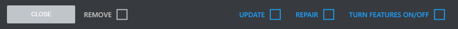
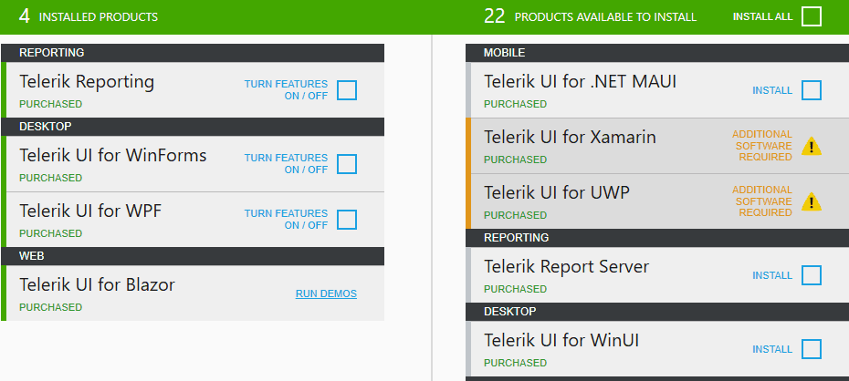

# Product details 

The product details view presents the information about the product, including product name, installation state, license, version, online resources and available actions. 

## Installation state 

The products’ installation state is displayed in the product detailed view as follows: 

* INSTALLED = Fully or partially installed product 
* MULTIPLE VERSIONS INSTALLED = Multiple versions installed, i.e. Q1 2013 and Q2 2013 (applicable for products that support parallel installations only) 
* NOT INSTALLED = Not installed product 
* OLDER VERSION INSTALLED = Older version is installed with limited support in the tool (versions before Q3 2011) 
* NEWER VERSION INSTALLED = Newer than the latest official version is installed (possible if an internal build is installed on the machine) 

## License 
 
The product license is displayed next to the installation state. It’s one of the following: 

* PURCHASED – Licensed product 
* TRIAL – Trial product 
* FREE – Free product 

## Version & Release date 

In the product details view one can check the version and the release date of the product. They are displayed just after the Installation State and the License. 

## Blocking issues 

The blocking issues details, if any, are displayed in red right under the product Installation State, License and Version. 

## Online resources 

In the product details view, you can find hyperlinks to the online resources for a product, e.g. Documentation, Blogs, Forums and Videos. 

## Actions 

All applicable product actions are displayed at the bottom of product details view. The possibly available actions include INSTALL, UPDATE, REPAIR, MODIFY and REMOVE. Only one action per product can be scheduled for execution. 

## All Versions 

In order to access all versions of the product you have license for, you can click on the **View All Versions** button which will switch to the All Versions view. 

In the **All Versions** view one can see a list of all products he has access to. This view provides the opportunity to operate with versions different than the latest one (including the latest Beta version if available). You can install previous versions or maintain old versions (e.g. perform modify, repair or remove). Additionally, there is an option to perform multiple actions with one configuration only.  
 
The **All Versions** view makes the dependencies between the product versions more clear. When selecting a version for install, the Progress Control Panel automatically resolves dependencies between the versions. This could trigger an installation of older conflicting versions or can disable the option to install previous conflicting version. 

The version dependency resolving depends on the **‘KEEP PREVIOUS PARALLEL VERSIONS’** option in the options menu. If the option is not checked, the dependency resolving mechanism will check older parallel versions for removal. Otherwise, old version won’t be pre-selected for removal. 
 
The visibility of the latest Beta version depends on the **‘OFFER BETA VERSIONS IF AVAILABLE’** option in the options menu. The Beta version is visible if the option is enabled and if it is the latest product version. Older Beta versions are not visible regardless the ‘OFFER BETA VERSIONS IF AVAILABLE’ option. 

## See Also

* [Telerik Control Panel Forum](https://www.telerik.com/forums/telerik-control-panel)
* [Progress® Telerik® Control Panel Feedback Portal](https://feedback.telerik.com/controlpanel) 
* [Essential support](http://www.telerik.com/support) 
