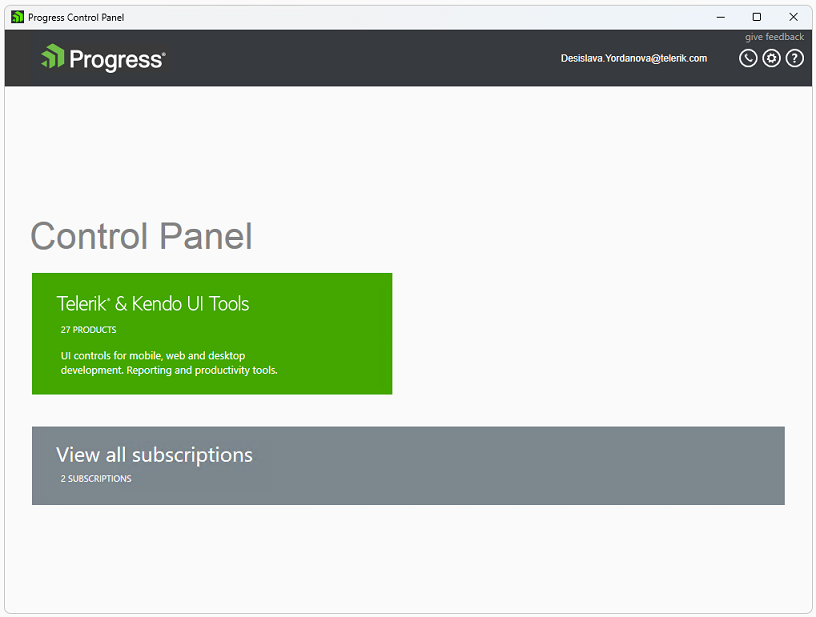
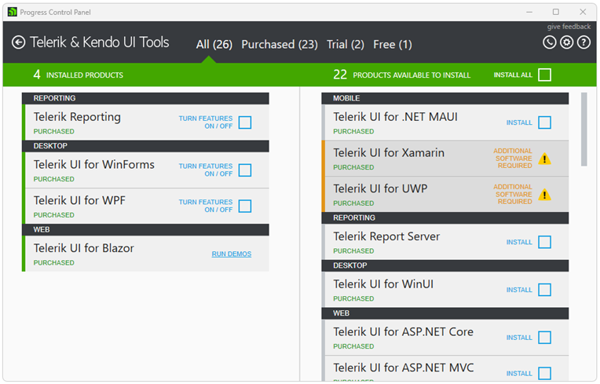
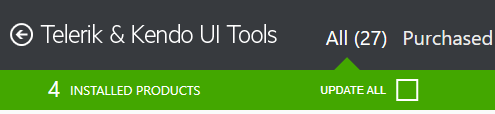
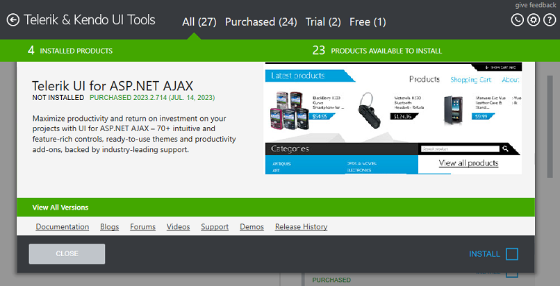
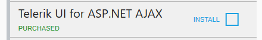
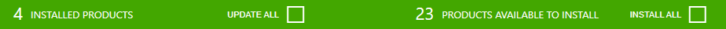
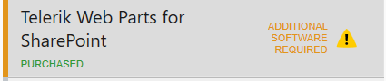
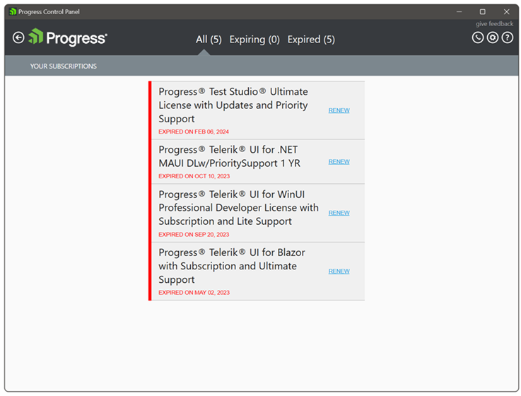

# Welcome Screen and Main View

The main view of the Control Panel is the starting point that lets you navigate to all menus and tools in the application:

* **Telerik & Kendo UI Tools** - contains all products available for installation or update.

* **View all subscriptions** - presents the subscriptions that expire in less than a year or that have expired less than a year ago.

The main view allows navigation to the product families and user subscriptions (if any). Each product family group represents its division products.

## Telerik & Kendo UI Tools View

Pressing the **Back** button on the left of the Telerik & Kendo UI Tools label will navigate back to the main view. 

### Licenses 

On the top of the view you will see the products grouped by license: 

* **All** - shows all products without filtering by license 

* **Purchased** - shows all purchased products of the user 

* **Trial** - shows all available trials for the user 

* **Free** - shows all free products 

### Product Details

The **Product Details** screen provides more information about the selected product. To open the **Product Details**, go to Telerik & Kendo UI Tools and click the desired product. 

The product details view presents the information about the product, including product name, installation state, license, version, online resources and available actions.

In the products view the products are sorted in two lists:

* **Installed products** (on the left) 

* **Products available to install** (on the right)
    
In both lists the products are grouped by their type, e.g. UI Controls, Productivity tools and so on. Each product is shown with its name, license and default action. By clicking on the product tile a product details view is shown (see Product Details). The installed products list contains the Beta versions available for installation. A Beta version is visible only if it is the latest version available. 

### Default actions 

In the products view,  the products have a default action. For installed products the default action depends on the product license that the current user has and whether the latest available version is installed. For products available for installation the default action is **INSTALL**. The rest of the available actions for each product are available in the Product Details view. 

### Mass actions 

All **INSTALL** and **UPDATE** default product actions could be selected with a single click by checking the **UPDATE ALL** or the **INSTALL ALL** checkboxes. 

### Blocked products 

The products that have blocking installation issues are marked with a yellow exclamation mark. You can get further details on the blocking issues by opening the Product Details view.

### Options

To open the Options menu, click on the Options gear icon in the right upper corner:

## View all subscriptions

The **Subscriptions** view displays information about license expiration date. The information is displayed only for those licenses that are about to expire in 15 months or that have expired in the last 15 months. The main purpose is to remind about expiring licenses and to provide the possibility to renew them.

*Without subscriptions*

If all your licenses are valid and not nearing expiration, no subscriptions will be listed, and the subscription tile will not be displayed.

*With subscriptions*

If you have licenses that are nearing expiration or have already expired, the subscriptions will be available. The subscription tile will be shown, displaying the number of licenses and the total number of renewal subscriptions.

At the top, there are 3 categories:

* **"All"** -- showing all subscriptions

* **"Expiring"** -- showing About to Expire subscriptions

* **"Expired"** -- showing all expired subscriptions

You can continue to use the products included in your subscription for as long as you require. Subscription expiry means that you will no longer be issued any product updates or new product releases. It is possible to renew your subscription at a lower cost than buying a new license. Early Renewals offer the best value, and must be purchased before your subscription expires. Standard Renewals can be purchased up to 60 days after expiry. Welcome Back Renewals are available more than 60 days after expiry.
Every subscription which is covered by the "Renewal" subscription classifier has a "RENEW" action, which opens the generic Telerik renewal page. You can find more detailed information about renewing licenses using the [License-renewals](https://www.telerik.com/purchase/license-renewals) page.

If a product from the Telerik & Kendo UI Tools family is already installed on the machine and there are no expiring or recently expired subscriptions that require the user attention, when the Control Panel is started it will navigate to DevCraft Ultimate family view.

Navigating back, opens the Home page.

## See Also

* [Telerik Control Panel Forum](https://www.telerik.com/forums/telerik-control-panel)
* [Progress® Telerik® Control Panel Feedback Portal](https://feedback.telerik.com/controlpanel) 
* [Essential support](http://www.telerik.com/support) 
