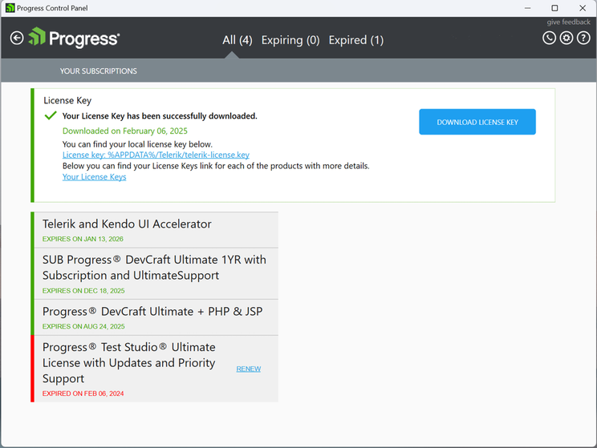

# Simplified Interface Guide

This simplified user interface guide walks you through the primary screens in the Telerik Control Panel and describes the main tasks you can perform using the tool.

## Main View

The main view of the Control Panel is the starting point that lets you navigate to all menus and tools in the application:

* **Telerik & Kendo UI Tools**—Shows all products available for installation or update. This view loads automatically if you have no expiring or recently expired subscriptions that require attention.

* **View all subscriptions**—Presents the license key status and subscriptions that will expire in less than 15 months or that have expired less than 15 months ago.

## Telerik & Kendo UI Tools View

The **Telerik & Kendo UI Tools View** shows the products in two columns:

* Installed products (on the left) 

* Products available to install (on the right)

### Filtering by License

To display only the Telerik & Kendo UI tools with a specific license, use the built-in filters on the top of the window:

* **All**—Shows all products without filtering by license.

* **Purchased**—Shows all products purchased by the user.

* **Trial**—Shows all available products with currently active trials for the user.

* **Free**—Shows all free products.

### Showing the Product Details

To see more information about a specific product or tool, click the tile with the desired product. This allows you to see the installation state, license, version, online resources, and available actions.

>tip By clicking on an installed product, you will also see the latest beta version (if a beta version is available).

## View Subscriptions

The Subscriptions view shows you the license key status and remind you about licenses that need renewal.

Starting with the Q1 2025 release, all Telerik and Kendo UI components will require activation with a license key (trial or commercial).

### Licensing Requirements
**Who needs a license key?**

Both perpetual and subscription customers have to add a license key file to their applications.

**How does it work?**

The stored license key acts as a snapshot of your licenses. A single license key file is required to authorize the access to all the Telerik and Kendo UI products.
You need a single license key file, which authorizes your access to all the Telerik and Kendo UI products included in the DevCraft bundle.

**Missing or Expired License Key**

If a valid license key is not found, you may experience:

* Limited functionality, such as watermarks.
* Build or runtime errors.
* Messages for unlicensed product.

**When Do You Need a New License Key?**

You have to obtain a new license key when you:

* Purchase or renew a new Telerik license.
* Start a new trial.

**Where is the license key stored?**

The license key file is sastored on your Windows machine in: %APPDATA%/Telerik/telerik-license.key

### Managing Your License Key
The Progress Control Panel automatically downloads your license key. You can use it to check the validity and the expiration date of your licenses.

**License Key Statuses**

Your license key can have one of the following statuses:

* **Valid** – You have a valid license for all Telerik and Kendo UI products.
* **Invalid** – The license key file is corrupted.
* **All Licenses Expired** – The licenses for all products have expired.
* **Some Licenses Expired** – The licenses for some products have expired.

The information about licenses that need renewal is displayed only for those that are about to expire in 15 months or that have expired in the last 15 months:

* If all your licenses are valid and not expiring soon, the subscription tile will not be displayed on the [main view](#Main-view) of the Control Panel.
* If you have licenses that are about to expire in 15 months or have already expired, the Subscriptions view is available and displays the licenses that you can renew.

For more information, see the [License Renewals](https://www.telerik.com/purchase/license-renewals) page.

## See Also

* [Telerik Control Panel Forum](https://www.telerik.com/forums/telerik-control-panel)
* [Progress® Telerik® Control Panel Feedback Portal](https://feedback.telerik.com/controlpanel) 
* [Essential support](http://www.telerik.com/support) 
