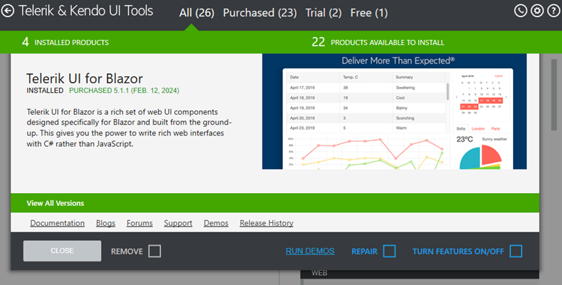

# Simplified Interface Guide

This simplified user interface guide walks you through the primary screens in the Telerik Control Panel and describes the main tasks you can perform using the tool.

## Main View

The main view of the Control Panel is the starting point that lets you navigate to all menus and tools in the application:

* **Telerik & Kendo UI Tools**—Shows all products available for installation or update. This view loads automatically if you have no expiring or recently expired subscriptions that require attention.

* **View all subscriptions**—Presents the subscriptions that expire in less than a year or that have expired less than a year ago.

## Telerik & Kendo UI Tools View

The **Telerik & Kendo UI Tools View** shows the products in two columns:

* Installed products (on the left) 

* Products available to install (on the right)

### Filtering by License

To display only the Telerik & Kendo UI tools with a specific license, use the built-in filters on the top of the window:

* **All**—Shows all products without filtering by license.

* **Purchased**—Shows all products purchased by the user.

* **Trial**—Shows all available products with currently active trials for the user.

* **Free**—Shows all free products.

### Showing the Product Details

To see more information about a specific product or tool, click the tile with the desired product. This allows you to see the installation state, license, version, online resources, and available actions.

>tip By clicking on an installed product, you will also see the latest beta version (if a beta version is available).

## View Subscriptions

The Subscriptions view shows you the license key status and remind you about licenses that need renewal.

Starting with the Q1 2025 release, Telerik and Kendo UI components require activation via a license key (trial or commercial). Both perpetual and subscription customers will have to add licensing files to their application.
The license key file stored on the machine represents a snapshot of your licenses. License key is stored under %APPDATA%/Telerik/telerik-license.key.
Without a valid license key, you may encounter limited functionality (e.g., watermarks), build or runtime errors, or messages indicating an unlicensed product.
The Control Panel automatically download and manage your license key.  You can to easily check the validity of your licenses and expiration date of your license key.

The license key available statutes are:
Valid - You have a valid license for all Telerik and Kendo UI products
Invalid - The license key file is corrupted
All licenses has expired - The licenses for all products are expired
Some of the licenses have expired - The licenses for some of the products are expired

The information is displayed only for those licenses that are about to expire in 15 months or that have expired in the last 15 months:

* If all your licenses are valid and not expiring soon, the subscription tile will not be displayed on the [main view](#welcome-screen-and-main-view) of the Control Panel.
* If you have licenses that are about to expire in 15 months or have already expired, the Subscriptions view is available and displays the licenses that you can renew.

For more information, see the [License Renewals](https://www.telerik.com/purchase/license-renewals) page.

## See Also

* [Telerik Control Panel Forum](https://www.telerik.com/forums/telerik-control-panel)
* [Progress® Telerik® Control Panel Feedback Portal](https://feedback.telerik.com/controlpanel) 
* [Essential support](http://www.telerik.com/support) 
