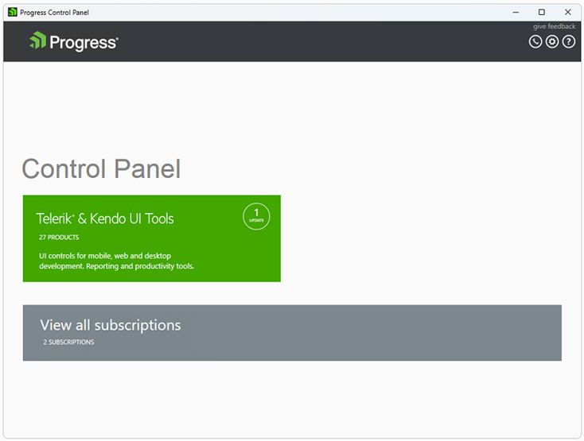
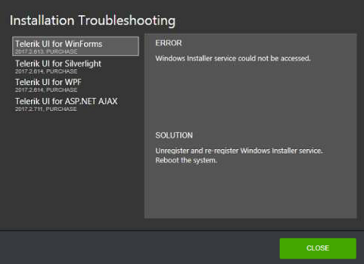

# Welcome Screen and Main View

The main view of the Control Panel is the starting point that lets you navigate to all menus and tools in the application:

* **Telerik & Kendo UI Tools** - contains all products available for installation or update.

* **View all subscriptions** - presents the subscriptions that expire in less than a year or that have expired less than a year ago.

The main view allows navigation to the product families and user subscriptions (if any). Each product family group represents its division products.

## Subscriptions View

The **Subscriptions** view displays information about license expiration date. The information is displayed only for those licenses that are about to expire in 15 months or that have expired in the last 15 months. The main purpose is to remind about expiring licenses and to provide the possibility to renew them.

*Without subscriptions*

If all your licenses are valid and not nearing expiration, no subscriptions will be listed, and the subscription tile will not be displayed.

*With subscriptions*

If you have licenses that are nearing expiration or have already expired, the subscriptions will be available. The subscription tile will be shown, displaying the number of licenses and the total number of renewal subscriptions.

At the top, there are 3 categories:

"All" -- showing all subscriptions

"Expiring" -- showing About to Expire subscriptions

"Expired" -- showing all expired subscriptions

You can continue to use the products included in your subscription for as long as you require. Subscription expiry means that you will no longer be issued any product updates or new product releases. It is possible to renew your subscription at a lower cost than buying a new license. Early Renewals offer the best value, and must be purchased before your subscription expires. Standard Renewals can be purchased up to 60 days after expiry. Welcome Back Renewals are available more than 60 days after expiry.
Every subscription which is covered by the "Renewal" subscription classifier has a "RENEW" action, which opens the generic Telerik renewal page. You can find more detailed information about renewing licenses using the [License-renewals](https://www.telerik.com/purchase/license-renewals) page.

If a product from the Telerik & Kendo UI Tools family is already installed on the machine and there are no expiring or recently expired subscriptions that require the user attention, when the Control Panel is started it will navigate to DevCraft Ultimate family view.

Navigating back, opens the Home page.

>caption Telerik & Kendo UI Tools View

Pressing the **Back** button on the left of the Telerik & Kendo UI Tools label will navigate back to the main view. 

## Licenses 

On the top of the view you will see the products grouped by license: 

* **All** - shows all products without filtering by license 

* **Purchased** - shows all purchased products of the user 

* **Trial** - shows all available trials for the user 

* **Free** - shows all free products 

## Product Details

In the products view the products are sorted in two lists:

* **Installed products** (on the left) 

* **Products available to install** (on the right)
    
In both lists the products are grouped by their type, e.g. UI Controls, Productivity tools and so on. Each product is shown with its name, license and default action. By clicking on the product tile a product details view is shown (see Product Details). The installed products list contains the Beta versions available for installation. A Beta version is visible only if it is the latest version available. 

## Default actions 

In the products view,  the products have a default action. For installed products the default action depends on the product license that the current user has and whether the latest available version is installed. For products available for installation the default action is **INSTALL**. The rest of the available actions for each product are available in the Product Details view. 

## Mass actions 

All **INSTALL** and **UPDATE** default product actions could be selected with a single click by checking the **UPDATE ALL** or the **INSTALL ALL** checkboxes. 

## Blocked products 

The products that have blocking installation issues are marked with a yellow exclamation mark. You can get further details on the blocking issues by opening the Product Details view. 

# Product Details 

The **Product Details** screen provides more information about the selected product. To open the **Product Details**, go to Telerik & Kendo UI Tools and click the desired product. 

The product details view presents the information about the product, including product name, installation state, license, version, online resources and available actions: 

### Installation state

The products' installation state is displayed in the product detailed view as follows: 

* **INSTALLED** = Fully or partially installed product 
* **MULTIPLE VERSIONS INSTALLED** = Multiple versions installed, i.e. Q1 2013 and Q2 2013 (applicable for products that support parallel installations only) 
* **NOT INSTALLED** = Not installed product 
* **OLDER VERSION INSTALLED** = Older version is installed with limited support in the tool (versions before Q3 2011) 
* **NEWER VERSION INSTALLED** = Newer than the latest official version is installed (possible if an internal build is installed on the machine) 

### License 
 
The product license is displayed next to the installation state. It is one of the following: 

* **PURCHASED** - Licensed product 
* **TRIAL** - Trial product 
* **FREE** - Free product 

### Version & Release date 

In the product details view one can check the version and the release date of the product. They are displayed just after the **Installation State** and the **License**. 

### Prerequisites

If any blocking issues occur, they should be resolved first, in order to continue with the installation. All requirements are displayed in red right under the product Installation State, License and Version:

### All Versions 

In order to access all versions of the product you have license for, you can click on the **View All Versions** button which will switch to the All Versions view. 

In the **All Versions** view one can see a list of all products he has access to. This view provides the opportunity to operate with versions different than the latest one (including the latest Beta version if available). You can install previous versions or maintain old versions (e.g. perform modify, repair or remove). Additionally, there is an option to perform multiple actions with one configuration only.  
 
The **All Versions** view makes the dependencies between the product versions more clear. When selecting a version for install, the Progress Control Panel automatically resolves dependencies between the versions. This could trigger an installation of older conflicting versions or can disable the option to install previous conflicting version. 

The version dependency resolving depends on the **‘KEEP PREVIOUS PARALLEL VERSIONS’** option in the options menu. If the option is not checked, the dependency resolving mechanism will check older parallel versions for removal. Otherwise, old version won’t be pre-selected for removal. 
 
The visibility of the latest Beta version depends on the **‘OFFER BETA VERSIONS IF AVAILABLE’** option in the options menu. The Beta version is visible if the option is enabled and if it is the latest product version. Older Beta versions are not visible regardless the ‘OFFER BETA VERSIONS IF AVAILABLE’ option. 

### Online resources 

In the product details view, you can find hyperlinks to the online resources for a product, e.g. Documentation, Blogs, Forums and Videos. 

## Actions 

All applicable product actions are displayed at the bottom of product details view. The possibly available actions include INSTALL, UPDATE, REPAIR, MODIFY and REMOVE. Only one action per product can be scheduled for execution. 

# Preview

After you have selected some product actions, they are displayed in the preview step for final arrangement. The preview step provides:

* **Feature selection option** - The editable features include all Visual Studio integration features for a product.
* **Install location selection option** - Prior to running the installation, you can change the installation folder for this run.
* **Disk cost estimations**
* **License Agreement**

## Installation progress

The installation progress view displays the installation information in three progress bars:
 * **Download progress**
 * **Current operation progress**
 * **Overall progress**

<!-- ### Download progress

The download progress bar displays the download progress for the installation. On the right side you will
see the downloaded megabytes and the total download estimation.

### Current operation progress

The current operation progress bar shows the current operation progress. The current operation can be
one of the following: installation, repair and uninstallation. In the middle of the progress bar the current
operation name is displayed and on the right – the operation details.

### Overall progress

The overall progress bar shows the overall installation progress. It displays the completed operations
and the total operation count. -->

## Installation Troubleshooting

In case you have any failed installations, you will see an error summary screen which describes the failed
installations.

In the left corner you will see the ‘TROUBLESHOOT PROBLEMS’ link. Click the link in order to get detailed information regarding the reason for the failure of each installation.

Additionally, you have the opportunity to send an error report by checking the ‘Send Error Report’ checkbox before closing this screen. To preview the content of the reports you would send, click the ‘PREVIEW ERROR REPORT’ link. Sending an error report will increase your chance to receive faster and more accurate answer in case you contact our support team and will help us in maintaining our products and solutions, so we can provide the top quality you expect.

In the ‘Installation Troubleshooting’ dialog a list of the failed installation is present. You can select a product on the left and check the reason for the failure and a possible solution on the right side of the window.

# Options

To open the Options menu, click on the Options gear icon in the right upper corner:

This menu allows you to modify the following options:

### Download settings

In the Download Settings section, you can set the default download directory for the application. By
default, the application stores its downloaded packages under
%programdata%\Progress\Installer\Downloads.

The default download location could be changed by clicking BROWSE and navigating to the desired folder. In order to reset to the default download location, click RESET. The default download location could also be cleaned by clicking DELETE CACHED INSTALLER PACKAGES. Clicking this button leads to a confirmation question: 

If the download location does not contain any installer packages the state of DELETE CACHED
INSTALLERS PACKAGES is disabled:

If some of the cached installers packages cannot be removed the
state of the button remains enabled.

### Proxy settings

The proxy settings section visualizes the current proxy settings of the application. With its default configuration the Progress Control Panel uses the system proxy settings.

In order to change the default proxy settings, uncheck the USE INTERNET EXPLORER PROXY SETTINGS checkbox and the proxy details section will appear. The PROXY ADDRESS and PORT fields are required if you choose to enter proxy settings manually. If the proxy requires authentication, the REQUIRES AUTHENTICATION checkbox should be checked and the proxy credential section will appear:

The USERNAME field is required if the authentication option is enabled. You can restore the default proxy settings any time by selecting the RESET option on the right.

## See Also

* [Telerik Control Panel Forum](https://www.telerik.com/forums/telerik-control-panel)
* [Progress® Telerik® Control Panel Feedback Portal](https://feedback.telerik.com/controlpanel) 
* [Essential support](http://www.telerik.com/support) 
