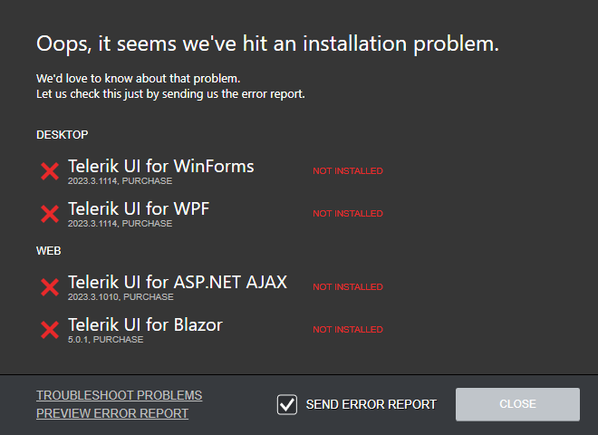
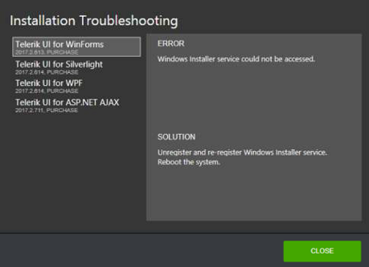

## Installation progress

The installation progress view displays the installation information in three progress bars:
 * **Download progress**
 * **Current operation progress**
 * **Overall progress**

<!-- ### Download progress

The download progress bar displays the download progress for the installation. On the right side you will
see the downloaded megabytes and the total download estimation.

### Current operation progress

The current operation progress bar shows the current operation progress. The current operation can be
one of the following: installation, repair and uninstallation. In the middle of the progress bar the current
operation name is displayed and on the right – the operation details.

### Overall progress

The overall progress bar shows the overall installation progress. It displays the completed operations
and the total operation count. -->

## Installation Troubleshooting

In case you have any failed installations, you will see an error summary screen which describes the failed
installations.

In the left corner you will see the ‘TROUBLESHOOT PROBLEMS’ link. Click the link in order to get detailed information regarding the reason for the failure of each installation.

Additionally, you have the opportunity to send an error report by checking the ‘Send Error Report’ checkbox before closing this screen. To preview the content of the reports you would send, click the ‘PREVIEW ERROR REPORT’ link. Sending an error report will increase your chance to receive faster and more accurate answer in case you contact our support team and will help us in maintaining our products and solutions, so we can provide the top quality you expect.

In the ‘Installation Troubleshooting’ dialog a list of the failed installation is present. You can select a product on the left and check the reason for the failure and a possible solution on the right side of the window.

## See Also

* [Telerik Control Panel Forum](https://www.telerik.com/forums/telerik-control-panel)
* [Progress® Telerik® Control Panel Feedback Portal](https://feedback.telerik.com/controlpanel) 
* [Essential support](http://www.telerik.com/support) 
