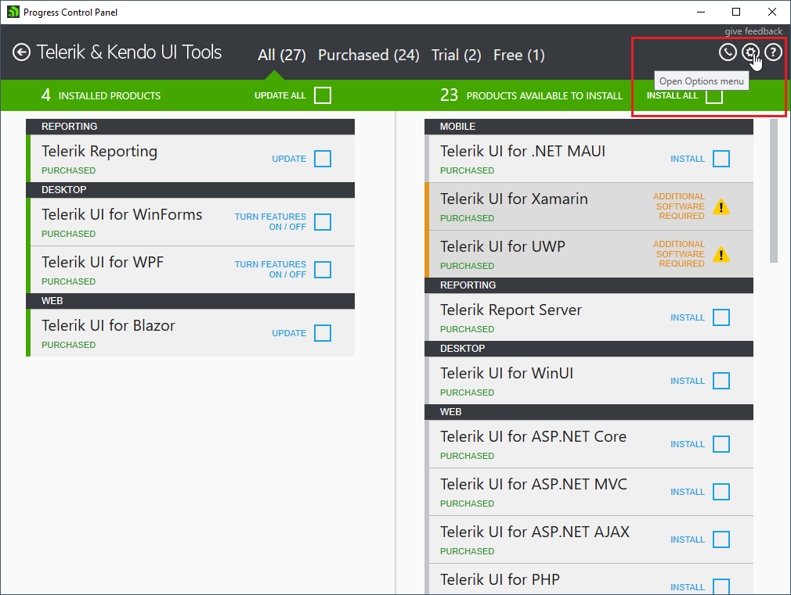
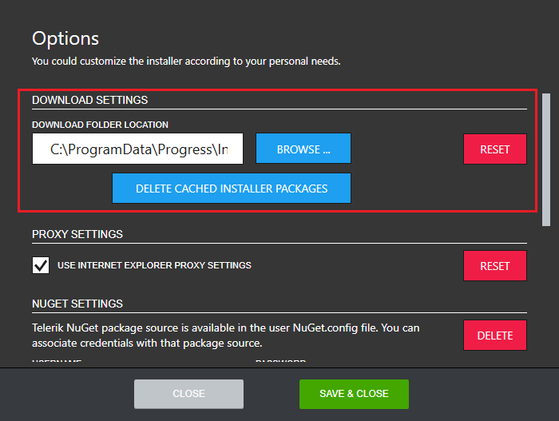
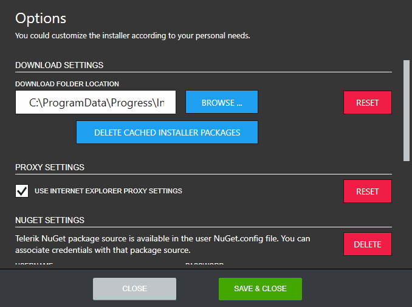
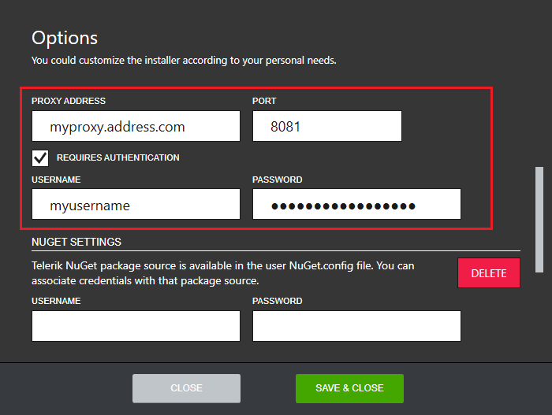
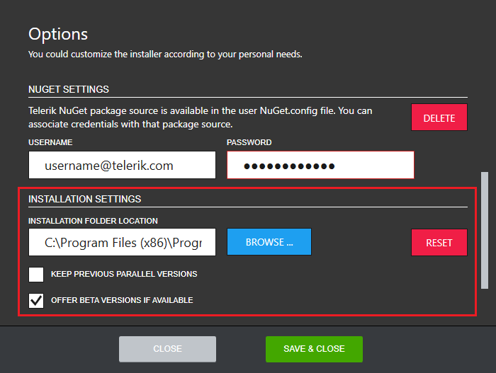
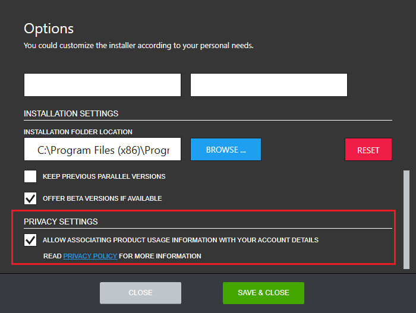

# Options

To open the Options menu, click on the Options gear icon in the right upper corner:

This menu allows you to modify the following options:

### Download settings

In the Download Settings section, you can set the default download directory for the application. By
default, the application stores its downloaded packages under
%programdata%\Progress\Installer\Downloads.

The default download location could be changed by clicking BROWSE and navigating to the desired folder. In order to reset to the default download location, click RESET. The default download location could also be cleaned by clicking DELETE CACHED INSTALLER PACKAGES. Clicking this button leads to a confirmation question: 

If the download location does not contain any installer packages the state of DELETE CACHED
INSTALLERS PACKAGES is disabled:

If some of the cached installers packages cannot be removed the
state of the button remains enabled.

### Proxy settings

The proxy settings section visualizes the current proxy settings of the application. With its default configuration the Progress Control Panel uses the system proxy settings.

In order to change the default proxy settings, uncheck the USE INTERNET EXPLORER PROXY SETTINGS checkbox and the proxy details section will appear. The PROXY ADDRESS and PORT fields are required if you choose to enter proxy settings manually. If the proxy requires authentication, the REQUIRES AUTHENTICATION checkbox should be checked and the proxy credential section will appear:

The USERNAME field is required if the authentication option is enabled. You can restore the default proxy settings any time by selecting the RESET option on the right.

### NuGet Settings

<!-- The NuGet settings section provides an easy way to set up the Telerik private feed as a package source in the current user environment.

 -->

### Installation settings

<!-- Three options are present in the installation settings section - installation location, previous version preservation and Beta versions.

In order to change the default installation folder, click BROWSE and navigate to the desired directory. The OFFER BETA VERSIONS IF AVAILABLE option enables the Beta versions functionality in the Progress Control Panel. If you need access to the latest Beta version of a product, the checkbox must be checked. The KEEP PREVIOUS PARALLEL VERSIONS option prevents the Progress Control Panel from removing previous versions. If you need to keep previous versions on the machine, the checkbox must be checked. -->

### Privacy Settings (EU users only)

<!-- This section visualizes the currently logged in user’s privacy preferences.

 -->

## See Also

* [Telerik Control Panel Forum](https://www.telerik.com/forums/telerik-control-panel)
* [Progress® Telerik® Control Panel Feedback Portal](https://feedback.telerik.com/controlpanel) 
* [Essential support](http://www.telerik.com/support) 
