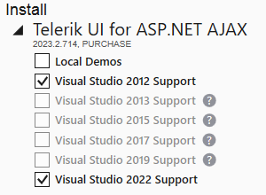
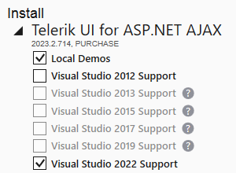
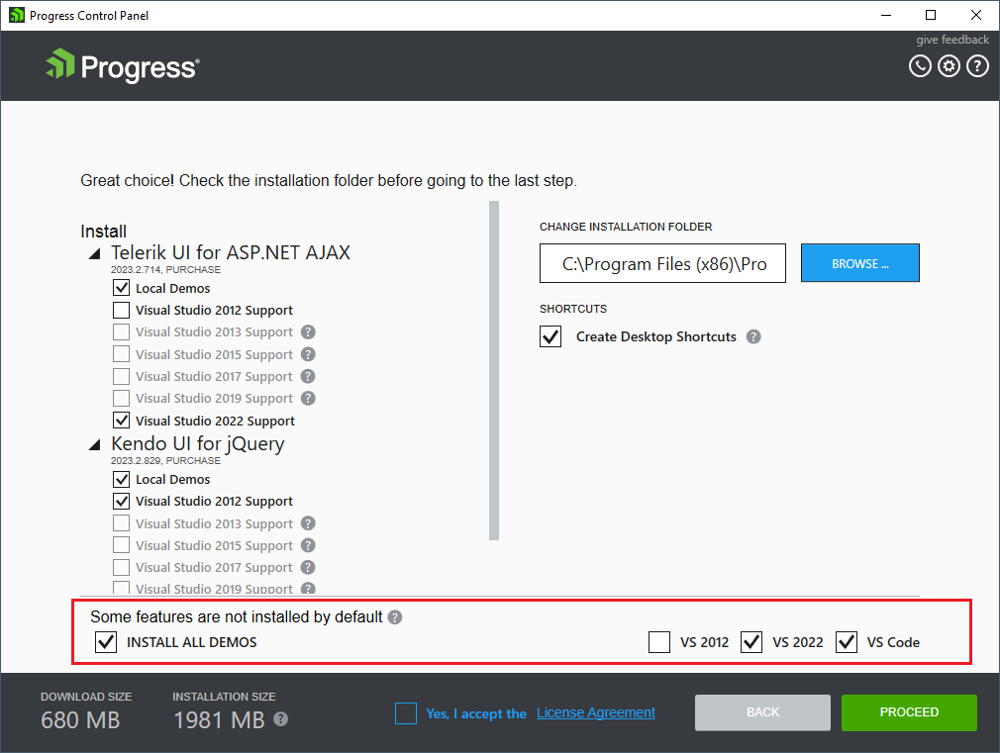
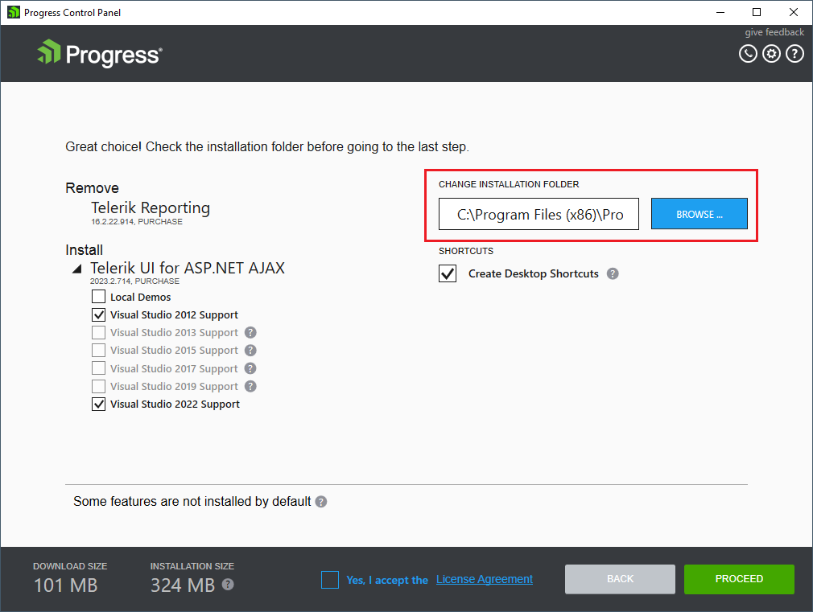
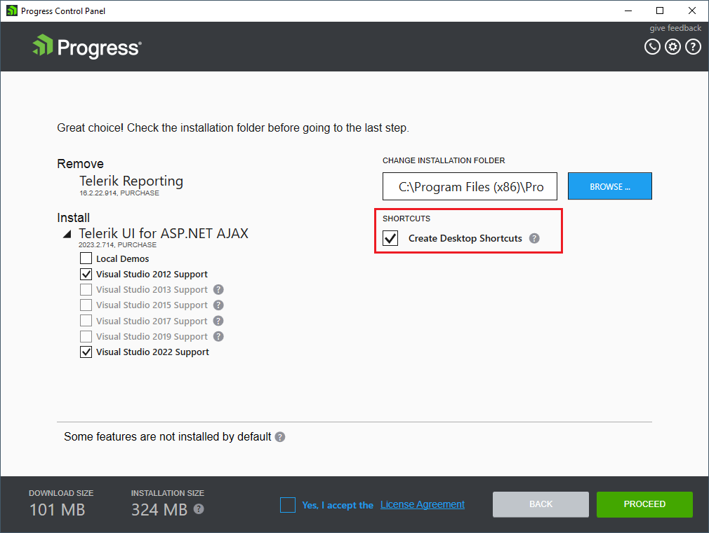
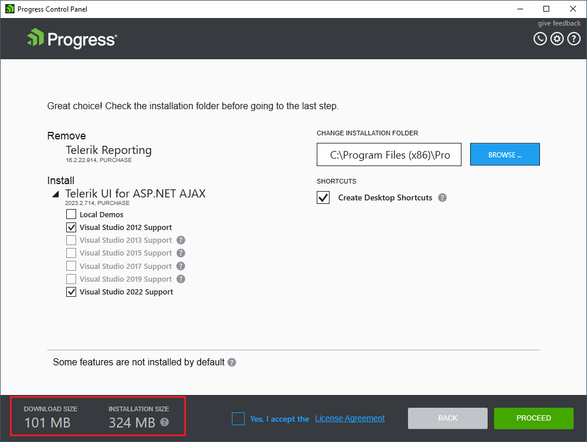
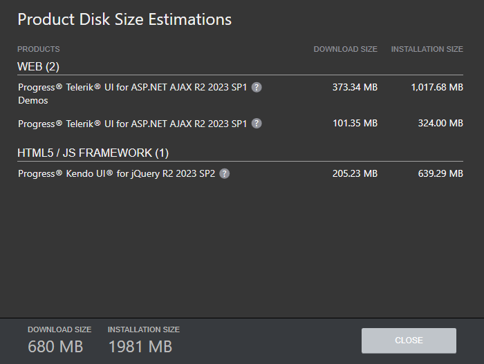
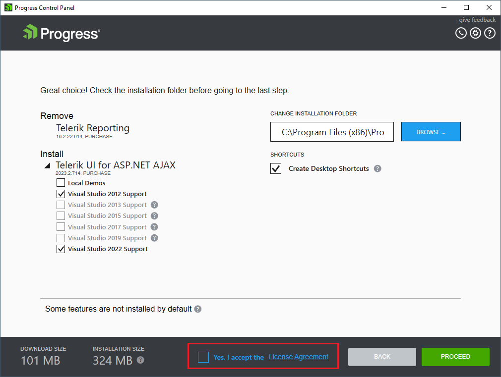
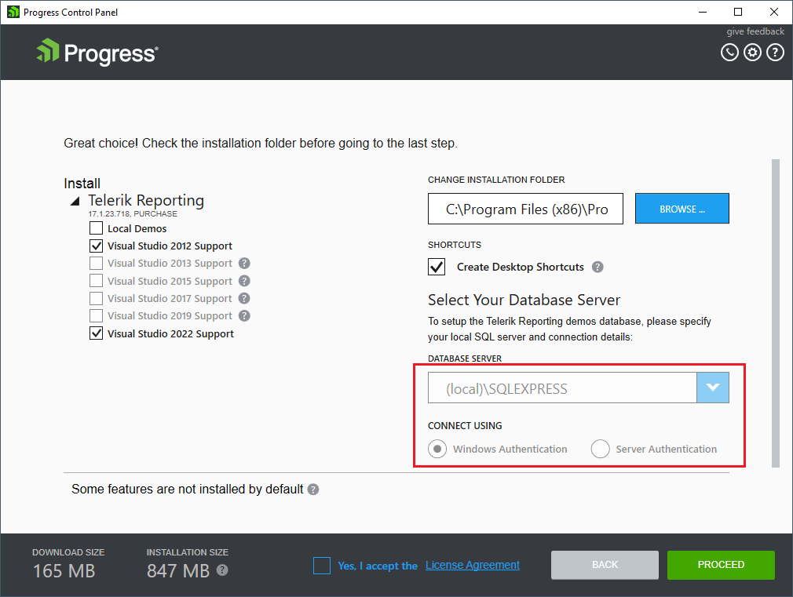
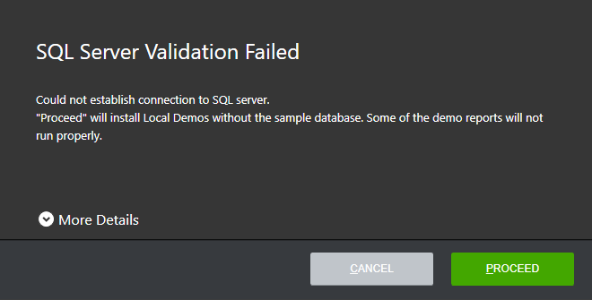

# Preview

After you have selected some product actions, they are displayed in the preview step for final arrangement. The preview step provides:

* **Feature selection option** - The editable features include all Visual Studio integration features for a product.
* **Install location selection option** - Prior to running the installation, you can change the installation folder for this run.
* **Disk cost estimations**
* **License Agreement**

<!-- ## Feature selection 

The Progress Control Panel provides a feature selection option. The editable features include all Visual
Studio integration features for a product (VS2012, VS2013, VS2015, VS2017, VS2019 and VS2022) and the Local Demos feature. You can customize the installation by including and excluding features for each product.

### Default selection

By default, the Progress Control Panel will include the integration feature for the latest Visual Studio
installed on the machine (if VS2012 and later are selected) and will exclude the local demos feature for
all selected products.

### Custom selection

The Progress Control Panel provides the option for custom installation, i.e. you can include different
Visual Studio integration features for different products and decide whether to install the local demos
for a product or not.

If all products will be configured with the same features, you can configure the installation globally from
the global feature selection on the bottom.

## Install location

Prior to running the installation, you can change the installation folder for this run. For changing the
default installation folder, see *How to change the Progress Control Panel default installation location* section.

## Desktop Shortcuts

Before running the installation, you can choose whether to create desktop shortcuts for all selected
products or product features that have any.

## Disk cost estimations

The disk cost estimations for the current selection is displayed in the bottom left corner of the preview
view. It can vary, depending on the feature selection of the products.

In order to see a detailed view of the disk cost estimations per product, click the question mark on the
right. In the detailed disk cost estimations view one can see the download and installation size of each
package, including the product prerequisites.

## License Agreement

Before running the installation process, you should accept the Progress License Agreement by checking
the license agreement checkbox. The full license agreement texts will be opened if you click the License
Agreement link.

## Products requiring additional configuration

### Reporting

In case Local Demos feature is selected Reporting setup requires additional configuration steps to be
performed before the installation starts. 

Otherwise the additional configuration options are grayed out.

On the right side of the page there are two options for Database Server Authentication Setup. The
account provided will be selected as the user used for connecting.

* **Windows Authentication** – uses the currently logged in Windows Account

* **Server Authentication** – Selecting this option expands two text fields to fill the **Login ID** and
**Password** fields of the account.

If connection with the database cannot be established a message informing that some of the demo
reports may not run correctly is shown.

 -->

## See Also

* [Telerik Control Panel Forum](https://www.telerik.com/forums/telerik-control-panel)
* [Progress® Telerik® Control Panel Feedback Portal](https://feedback.telerik.com/controlpanel) 
* [Essential support](http://www.telerik.com/support) 
